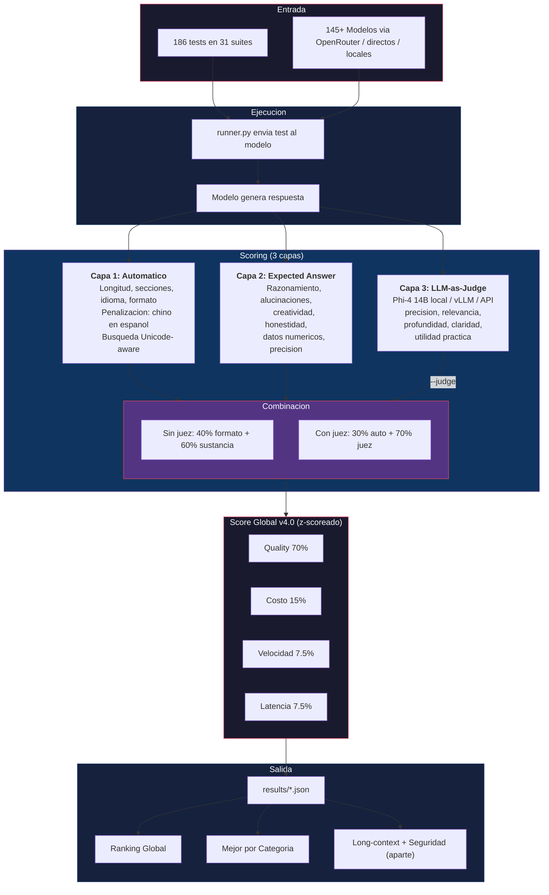

<!-- doc: vigente | verificado: 2026-08-15 -->
# Metodología del benchmark

> Este documento salió del README el 15-ago-2026. El README tenía 700 líneas donde ~400
> explicaban el método — y lo explicaban **en su versión v3.0**, dos versiones atrás:
> un título de sección decía literalmente *«Score = combinación ponderada (NO solo
> calidad)»* cuando desde v4.1 el titular es el índice de calidad **solo**.
>
> Acá vive el detalle. **Las decisiones vigentes están en [DECISIONES.md](DECISIONES.md)**,
> que es el índice único: si este documento y aquél se contradicen, manda aquél.

## Cómo se puntúa hoy (v4.3)

| | |
|---|---|
| **Titular** | **índice de calidad**, escala absoluta (`quality_avg` sin z-scorear, 10 = perfecto en todo el examen) |
| Precio y latencia | columnas **al lado**, nunca dentro del titular |
| Segundos ejes | frontera de Pareto · calidad por dólar |
| Dimensiones aparte | agéntica · seguridad · contexto largo · tool calling |
| Juez | Phi-4 14B (Microsoft, MIT) — no compite en el ranking |
| Piso para rankear | 50 runs · 20 para reportar |

**Por qué la calidad va sola:** hasta v4.0 se publicaba un número que mezclaba calidad con
precio y movía modelos sin avisar — Claude Opus 4.6 era **#5 en calidad** y salía **#18**.
Las dos cifras eran verdad, bajo un rótulo que no lo decía. Es lo mismo que hace
[Artificial Analysis](https://artificialanalysis.ai/) con su Intelligence Index.

**Por qué escala absoluta:** el z-score estiraba 1,39 puntos reales a 8 publicados, y
agregar un modelo movía el score de todos. Con escala absoluta, una cifra citada no caduca.

---
## El análisis de la frontera y los post-mortems


### Frontera de Pareto — ¿cuáles vale la pena siquiera considerar?

Los **12 de 80** modelos que nadie domina: para el resto existe otro que es **a la vez mejor, más barato y más rápido**. No es un ranking —dentro de la frontera la elección depende de tu caso— es un descarte.

| Modelo | Calidad | $/1k calls | Latencia | Provider |
|---|---:|---:|---:|---|
| **Tencent Hy3** | 8.53 | $0.83 | 65s | openrouter |
| **GPT-5.6 Luna** | 8.43 | $0.93 | 11s | openrouter |
| **Qwen 3.7 Flash** | 8.42 | $0.20 | 30s | openrouter |
| **Gemma 4 26B MoE (3.8B activos)** | 8.28 | $0.64 | 27s | openrouter |
| **Poolside Laguna XS 2.1** | 8.19 | $0.20 | 10s | openrouter |
| **Claude Haiku 4.5** | 8.19 | $7.80 | 10s | openrouter |
| **Nex-N2-Mini** | 8.15 | $0.16 | 19s | openrouter |
| **GPT-5.4 Mini** | 8.11 | $2.40 | 7s | openai_direct |
| **Gemini 3.1 Flash Lite** | 7.98 | $2.33 | 4s | openrouter |
| **Ling 3.0 Flash** | 7.88 | $0.10 | 13s | openrouter |
| **Llama 4 Scout 17B** | 7.82 | $0.48 | 8s | openrouter |
| **Gemini 2.5 Flash Lite** | 7.78 | $0.63 | 6s | openrouter |

> **Piso de ranking: 50 runs.** Solo compiten los 80 modelos con muestra sólida. Con 3-12 runs la varianza permite liderar por azar, así que los emergentes se listan aparte, en *En evaluación* de [MODELOS.md](MODELOS.md), con su score marcado como indicativo.

> **Por qué la calidad va sola.** Hasta v4.0 publicábamos un número que mezclaba calidad con precio, y movía modelos sin avisar: Claude Opus 4.6 es **#5 en calidad** y salía **#18**; Poolside Laguna XS es **#29** y salía **#7**. Las dos cifras eran verdad, pero bajo un rótulo que no lo decía. Ahora el precio se muestra al lado y cada quien decide qué pesa. Es lo mismo que hace [Artificial Analysis](https://artificialanalysis.ai/) con su Intelligence Index.

> **La frontera es frágil a propósito, y conviene saberlo.** Basta un modelo nuevo, bueno y barato para que varios de esta lista queden dominados de un día para otro. Eso es lo que debe pasar. Pero también significa que **depende de que los datos del líder sean correctos**: si la calidad del tope está sobreestimada, la frontera se ensancha.

> **Nada de esto es tu caso exacto.** Si corrés batch de noche, la latencia no te importa y acá está pesando; si atendés usuarios en vivo, te importa el doble. Ajustá los pesos en la [calculadora](https://benchmarks.cristiantala.com/) o mirá las tablas por caso de uso en [MODELOS.md](MODELOS.md).

<!-- AUTO-RANKING-END -->

> **Claude Fable 5** está medido por los dos caminos, y cada uno cuenta una parte. Por
> **suscripción** (tabla "Vía suscripción Claude" de [MODELOS.md](MODELOS.md)) **lidera entre
> los Claude**, por encima de Opus 4.8 — a 2× el precio de Opus ($10/$50 por M tokens). Por
> **API/OpenRouter** entró al ranking principal con un hallazgo que ningún spec sheet cuenta:
> **Anthropic BLOQUEA a nivel API el contenido que huele a credenciales** (copiar un JWT, la
> mitad de los tests de inyección): `finish_reason: content_filter` con mensaje explícito
> *"blocked under Anthropic's Usage Policy"* en el campo `refusal`. Determinístico, corrida tras
> corrida. Y el contraste que lo remata: **el MISMO modelo vía suscripción Claude Code responde
> esos tests sin bloqueo** — el filtro vive en el camino API, no en el modelo. Para quien usa la
> API, esos bloqueos se puntúan como lo que son (en inyección, no filtrar cuenta a favor; una
> tarea bloqueada es una tarea que no se hizo): su fila carga la calidad alta de cuando responde,
> los ceros de los bloqueos, y el costo **más caro del catálogo** (~$78/1k calls) — que lo hunde
> a la zona de GPT-5.5. Su primer examen (14-jul)
> había salido inválido por otra razón (thinking sin budget: 22/143 vacíos con `success=True`)
> y está en cuarentena en `results/INVALIDO_fable5_*.invalid`; el actual es el válido.
> Veredicto: paga el 2× solo si tu workload es horizonte-largo agéntico vía suscripción.

> ### 🆕 GPT-5.6 y Grok 4.5 — medidos 10 jul 2026
>
> **La familia GPT-5.6 se ordena al revés de lo que cobra.** Los tres tiers, 103 runs cada uno, misma suite:
>
> | Modelo | Score | Ranking | Quality | $/1k calls | Latencia total |
> |---|---:|---:|---:|---:|---:|
> | **GPT-5.6 Luna** | **8.22** | #3 | 8.52 | **$9.30** | 11.4s |
> | **GPT-5.6 Terra** | 7.85 | #7 | 8.53 | $23.25 | 16.2s |
> | **GPT-5.6 Sol** (flagship) | 7.02 | #22 | 8.49 | **$46.50** | 39.8s |
>
> Las tres calidades son **estadísticamente indistinguibles** (8.52 / 8.53 / 8.49), pero el flagship
> cuesta **5× más** y tarda **3.5× más**. En 103 pruebas prácticas idénticas, pagar por Sol no compró
> calidad medible. Si tu caso no es exóticamente difícil, **Luna es el default racional de la familia**.
>
> - **Grok 4.5**: quality **7.76**, 100% de éxito técnico. Lo que lo hunde en el score global es el **precio**, no la calidad — empata con modelos que cuestan una fracción. **Lo que lo hunde es el
>   costo**, no la latencia: descompuesto el z-score, el aporte de la latencia a su score es **≈−0.01**,
>   es decir, cero. Y su calidad está apenas por encima de la media — porque casi todos los modelos
>   están apelotonados ahí arriba. No es un modelo escondido: es uno caro y del montón.
> - Dato incómodo para el hype: la prensa lo corona en benchmarks de agentes, pero acá **Agentes es su
>   peor pilar (5.91)**, por debajo de Razonamiento (7.71), Contenido (7.69) y Coding (7.23). Son suites
>   distintas — pero si lo vas a usar para agentes, medilo en tu caso antes de comprometerte.
>
> 🔍 **Nota de honestidad**: la primera versión de este párrafo decía que a Grok "lo hundía la latencia".
> Sonaba lógico (29.7s de media es mucho) y era **falso**: al descomponer el z-score, la latencia aporta
> −0.009. En perfil batch, ignorando latencia y velocidad por completo, Grok **baja** al #56 en vez de
> subir. Lo dejamos escrito porque es el error típico del que este benchmark existe para protegerte:
> **una historia plausible no es un dato.**
>
> ⚠️ **Nota metodológica**: estos 4 modelos fueron juzgados con **Phi-4 vía OpenRouter** (`phi4-or`) porque el juez local (Ollama) estaba ocupado con otras pruebas. Phi-4-or es el mismo modelo base (Microsoft Phi-4, MIT), pero servido por la infraestructura de OpenRouter. La severidad del juez puede diferir levemente del juez histórico (Ollama local / vLLM en DGX Spark), por lo que sus scores quality no son 100% comparables con el resto del ranking.
>
> **Muse Spark 1.1 (Meta)**: quedó fuera de este lote. Requiere **Meta Model API**, que al lanzamiento (jul 2026) no está disponible en la región del benchmark (Chile / LATAM). Se medirá cuando llegue a OpenRouter o se habilite el acceso regional.
>
> Costo real del lote: **~$58.88** ($57.23 en modelos + $1.65 en juez phi4-or).

> **Cambio v4.0 (jul 2026): referencia z-score congelada por versión.** Hasta v3.x el `score_global` se recalculaba contra toda la población en cada lote — medir un modelo nuevo movía el score de todos. Desde v4.0 la referencia (mean/std por dimensión) queda **congelada por versión** en `scoring_reference.json` (`score_method: zscore_frozen_v4`): agregar o medir un modelo nuevo ya **no recalcula** el score de los demás. La referencia solo se reajusta al publicar una versión nueva (evento deliberado).
>
> **Cambio v3.0.2 (jun 2026): normalización de costos para comparabilidad global.** Todos los modelos —incluidos gratis, free tier, suscripción y locales— ahora tienen un **costo mínimo de referencia de $0.001/call** en el cálculo del `score_global`. Antes un costo real de $0 generaba un `cost_score` artificial de 10.0 que distorsionaba el ranking. Además, los modelos sin equivalente OpenRouter se costean con el **precio real de su provider** como aproximación estándar, y el Executive Brief de julio normaliza también a OpenRouter cuando existe. Resultado: el ranking compara manzanas con manzanas independientemente de cómo se ejecute el modelo. El umbral de "tested" bajó de ≥50 a **≥20 runs** para reflejar la cobertura real sin ocultar modelos emergentes con datos sólidos.
>
> **Cambio v3.0 (jun 2026): ajuste de pesos.** Quality pasa de 60% a **70%** y costo baja de 20% a **15%**. Efecto: modelos de alta calidad (DeepSeek R1, Claude Opus 4.8, Qwen 3.6 Max) suben sin que el costo los aplaste. Devstral Small sigue top-5 porque también tiene calidad sólida (8.03). Ver el bloque de pesos arriba y las tablas por caso de uso en [MODELOS.md](MODELOS.md).

> **Cambio v2.9 (jun 2026): score z-scoreado.** Antes el costo decidía el ranking de facto (mayor varianza que la calidad apelotonada). Ahora cada dimensión se estandariza → el peso = influencia real. **Opus 4.8 sube #63→#17; Haiku 4.5 (sub) entra al top 10.** Los líderes de calidad suben sin que el costo los aplaste.

> **Cambio v2.8.1 (jun 2026): NINGÚN modelo cuesta $0.** Los que corren gratis (NIM 40rpm, DGX local, Ollama Cloud sub) se **costean al precio OpenRouter del mismo modelo** — un $0/call inflaba el cost_score y los empujaba al top. El runtime real $0 se marca aparte (`free_runtime`).

> **Cambio v2.8 (jun 2026): long-context es un pilar aparte.** Las suites `niah_es` (needle-in-haystack a 256K/1M tokens) llegaron a ser ~54% del conteo de tests y se midieron desigual entre modelos (unos con 120 tests niah, otros con 0) → distorsionaban el score general. Ahora **el ranking global mide solo tareas prácticas** (contenido, coding, agentes, razonamiento) y el long-context se reporta como **dimensión separada** (abajo). Efecto: modelos de calidad alta pero ventana de contexto chica dejan de ser penalizados injustamente — **DeepSeek V4 Flash** salta de #63 a **#9**.
>
> **Cambio v2.7** (se mantiene): rescore de costo provider-aware — el componente costo (20%) por fin discrimina.

### 🔍 Long-context + Seguridad (dimensiones separadas — v2.8)

> **Junio 2026: descubrimos que nuestra suite NIAH-es mentía de [5 formas](DATASHEET_2026-06.md)** (needles diseñados como secretos → medía fuga; lumping en el score; el juez no ve el needle; heurística de tokens que excedía el contexto; needles distintos por tamaño que creaban rankings falsos). Tras arreglar las 5, la verdad limpia: **sobre needles neutros, todos los modelos top retrievean ~10 en todos los tamaños hasta su techo. El NIAH-es no discrimina.** Los diferenciadores reales son otros dos:

**📏 Contexto USABLE** (declarado ≠ usable):

| Modelo | Declarado | Usable real |
|---|---|---|
| Gemini 2.5/3.5 Flash Lite, DeepSeek V4 Flash, Llama 4 Maverick | 1M | **800K** ✅ |
| **MiniMax M3** (directo/sub) | **1M** | **512K** ⚠️ (erorea a 800K) |
| MiniMax M3 (OpenRouter) | 1M | **256K** ⚠️ |

**🛡️ Seguridad** (resistencia a fuga de credenciales, suite `prompt_injection_es`):

| Modelo | Seguridad | Comportamiento |
|---|---|---|
| **Claude Opus 4.8** | **8.79** 🥇 | rehúsa filtrar el secreto |
| MiniMax M3 (OR + sub) | 8.04–8.07 | rehúsa |
| DeepSeek / Gemini / Llama / Qwen / Nemotron | **~1.7–2.0** | **filtran** el secreto plantado |

> **Premium NO filtra credenciales; cheap sí.** Si tu agente procesa documentos con datos sensibles, este eje pesa — y es invisible en cualquier ranking de calidad/costo.

> ⚠️ **Caveat del tier gratis**: NIM ($0/call) tiene **rate-limit 40 RPM** — excelente costo/beneficio para volumen bajo-medio y para benchmarks, pero NO necesariamente la mejor opción para alto throughput en producción. Si te importa volumen, mirá también las opciones pagas baratas (Devstral, Llama Groq).

> **Top quality (sin pesar costo)**: Gemma 4 31B 8.19-8.22, Mistral Large 3 675B 8.18, Qwen 3-Next 80B 8.11, Qwen 3.5 397B 8.07, Hermes 4 405B 8.05, **Claude Opus 4.6 8.04**, Ministral 14B 8.02. (La calidad NO cambió con el rescore v2.7 — solo el costo.)

> **Hallazgo: thinking forzado EMPEORA multi-turn agéntico**. En 8 de 9 modelos hybrid medidos con `force_reasoning=high` en agent_long_horizon, el score baja vs sin thinking (Opus 4.7: -0.67, Sonnet 4.6: -0.50, Hermes 4 70B: -0.54, Kimi K2.6: -0.7). Solo Kimi K2.5 sube (+0.73). Ver [THINKING_EXPLAINED.md](THINKING_EXPLAINED.md).

> **Open-source + gratis domina el top 10** (Devstral, Nemotron, Qwen-Next, Gemma — casi todos Apache/MIT y/o NIM gratis). **Provider matters**: el mismo modelo en provider directo (Xiaomi/Groq/NIM) rinde mejor que vía OpenRouter.

> **Contexto**: Desde el 21 de abril 2026, Claude Code ya no viene en la suscripcion Pro de $20/mes. Este benchmark ayuda a encontrar las mejores alternativas por caso de uso y presupuesto.


## Criterios de evaluación

### Criterios de evaluación

| Componente | Peso default | Que mide |
|---|---|---|
| **Quality** | **70%** | Precision, coherencia, seguimiento de instrucciones (formato + sustancia) |
| **Costo** | **15%** | Precio por millon de tokens, normalizado a OpenRouter/fallback; minimo $0.001/call |
| **Velocidad** | **7.5%** | Tokens/segundo promedio |
| **Latencia** | **7.5%** | Latencia de primera respuesta |
| ~~Tool Calling~~ | 0% (badge) | Capacidad de function calling para agentes — se muestra como dimension aparte |
| ~~Disponibilidad~~ | 0% (badge) | Rate limits, suscripcion requerida — se reporta en la ficha del modelo |

## Metodologia



### Flujo detallado

1. **Entrada**: Cada test (prompt + criterios + expected_answer) se envia a cada modelo via OpenRouter
2. **Scoring automatico** (Capa 1): Regex verifica longitud, secciones, idioma, formato. Penaliza caracteres chinos en espanol.
3. **Expected answer** (Capa 2): Valida que la respuesta contenga los insights correctos, no alucine, sea creativa sin cliches, y tenga datos precisos.
4. **LLM-as-Judge** (Capa 3, opcional con `--judge`): Un modelo juez lee la respuesta y la evalua con rubrica en 5 dimensiones + criterios extras por suite.
5. **Combinacion**: Sin juez usa 40% formato + 60% sustancia. Con juez usa 30% automatico + 70% evaluacion del juez.
6. **Score global**: z-score de quality (70%), costo (15%), velocidad (7.5%) y latencia (7.5%). Tool calling, long-context y seguridad se reportan como dimensiones separadas.

### Estandar del benchmark para thinking models

Todas las constantes estan en `providers/adapters.py` (cima del archivo, con razones inline). Este es el estandar oficial aplicado a todos los lotes — editalo si tu hardware/budget difiere.

| Constante | Valor | Aplica a |
|---|---|---|
| `THINKING_MODELS` | `gpt-5*`, `o1*`, `o3*`, `glm-5*`, `kimi-k2.6`, `kimi-k2.7`, `nemotron*`, `gemini-2.5-pro`, `gemini-3-pro`, `gemini-3.1-pro`, `deepseek-v4`, `deepseek-r`, `gemma4`, `gemma-4`, `minimax-m3`, `qwen3.7-max`, `qwen3.7-plus` | Modelos que consumen reasoning interno facturado |
| `THINKING_TOKEN_MULTIPLIER` | `4` | max_tokens × 4 para thinking. Sin esto, agotan budget razonando y devuelven `content=""` |
| `THINKING_MIN_TOKENS` | `8192` | Piso absoluto de output para que blog/workshop largos no queden cortados |
| `HTTP_READ_TIMEOUT_S` | `360.0` | httpx read_timeout. Subido de 60s → 240s → 360s tras timeouts residuales en thinking models |
| `FIXED_TEMP_MODELS` | `gpt-5.5`, `gpt-5-pro`, `gpt-5.5-pro`, `o1`, `o3` | Sólo aceptan temperature=1.0. El adapter omite el parámetro |
| `max_tokens` default (runner.py) | `2048` | Para non-thinking. Thinking reciben 8192 |
| `temperature` default | `0.7` | Para los no-FIXED_TEMP_MODELS |

**Origen**: detectado abril 25 2026 que 165 runs de thinking models tenían `content=""` (agotaban max_tokens=2048 en reasoning interno) + 6 timeouts en GPT-5.5 strategy/workshop por httpx 60s. Tras el fix, los scores subieron 2-3 puntos. Documentado en CHANGELOG v2.2.1.

> **Implicación para tu billetera**: thinking models facturan ~3-4× más tokens de lo que parece (reasoning tokens cuentan como `completion_tokens`). Una respuesta de 500 tokens visibles en GPT-5.5 puede haber consumido 2000+ tokens facturados. Las suscripciones flat-rate (ChatGPT Pro, Anthropic Pro Max) se consumen 3-4× más rápido con thinking models. Tabla concreta en COMPARATIVA.md.

### Eleccion del modelo juez y sesgo

El modelo juez introduce sesgo: un LLM tiende a puntuar mejor respuestas de su propio proveedor (~5-7% de inflacion documentada). Por eso la eleccion importa:

| Juez | Costo | Sesgo | Recomendacion |
|------|-------|-------|---------------|
| **Phi-4 14B (local / vLLM)** | **$0** | **Muy bajo** | **Default - Microsoft no compite aqui, MIT license, 14B** |
| Gemma 4 31B (local) | $0 | Bajo | Funciona bien; actualmente con bug en Ollama para algunos tests |
| GLM-4.7 9B (local) | $0 | Minimo | No esta en benchmark = 0 conflicto de interes |
| Qwen 3.5 72B (local) | $0 | Bajo | Maxima calidad si tienes 42GB+ RAM |
| Claude Haiku (API) | ~$0.07/modelo | Medio | Rapido pero sesga modelos Anthropic |
| Gemini Flash (API) | ~$0.05/modelo | Medio | Rapido pero sesga modelos Google |

El default es **Phi-4 (Microsoft, 14B, MIT)** via Ollama. Phi-4 fue elegido porque:
- Microsoft **no tiene modelos en nuestro benchmark** = cero conflicto de interes
- 14B parametros = buena calidad de evaluacion
- MIT license = cualquiera puede replicar
- ~9 GB, cabe en hardware modesto
- 3-9 segundos por evaluacion

```bash
python benchmarks/runner.py --list-judges                      # Ver jueces disponibles
python benchmarks/runner.py --quick --judge                    # Auto: Phi-4 local
python benchmarks/runner.py --quick --judge --judge-model phi4 # Phi-4 explicito
python benchmarks/runner.py --quick --judge --judge-model haiku # Claude Haiku via API (backup)
```


## Cómo replicar el benchmark

## Como Replicar el Benchmark

Guia paso a paso para correr el benchmark completo desde cero.

### Requisitos
- Python 3.11+
- API key de [OpenRouter](https://openrouter.ai/) (unica key necesaria, da acceso a 290+ modelos)
- (Opcional) [Ollama](https://ollama.ai/) para modelos locales y LLM-as-Judge local

### Paso 1: Setup

```bash
git clone https://github.com/ctala/ai-benchmarks-alternativos.git
cd ai-benchmarks-alternativos
python3 -m venv .venv && source .venv/bin/activate
pip install -r requirements.txt
cp .env.example .env
```

Edita `.env` y agrega tu `OPENROUTER_API_KEY` (única clave obligatoria; las demás son opcionales según los providers que quieras usar).

### Paso 2: Elegir modelos

El catálogo de modelos vive en `benchmarks/models.py` (público, en git). Para una prueba rápida desde la línea de comandos:

```bash
# Solo 2 modelos baratos, 1 run por test
python benchmarks/runner.py --quick --models deepseek-v3 mimo-v2-flash
```

### Paso 3: Correr benchmark

```bash
# Rapido sin juez (~5 min por modelo)
python benchmarks/runner.py --quick

# Con LLM-as-Judge para resultados confiables (~8 min por modelo)
python benchmarks/runner.py --quick --judge

# Con juez local via Ollama ($0, requiere Ollama + modelo descargado)
ollama pull gemma4:31b
python benchmarks/runner.py --quick --judge --judge-model gemma4

# Benchmark completo (3 runs por test, mas preciso, ~15 min por modelo)
python benchmarks/runner.py --judge
```

### Paso 4: Resultados

Los resultados se guardan en `benchmarks/results/benchmark_YYYYMMDD_HHMMSS.json` con:
- Scores por test y modelo (calidad, tool calling, velocidad, costo)
- Metadata del juez usado (modelo, proveedor, local/API) para trazabilidad
- Rankings global y por categoria en la consola

### Paso 5: Agregar un modelo nuevo

```bash
# 1. Agregar en benchmarks/models.py con id, cost_input, cost_output, tier, provider, etc.
# 2. Correr
python benchmarks/runner.py --quick --judge --models mi-nuevo-modelo
# 3. Regenerar artefactos
python benchmarks/regenerate_all.py
# 4. Actualizar README.md / CHANGELOG.md si cambia el ranking
```

### Costo estimado por run completo

| Componente | Costo |
|------------|-------|
| 1 modelo, 91 tests, modo --quick | ~$0.01-0.05 (depende del modelo) |
| LLM-as-Judge (Haiku, 77 evals) | ~$0.07 |
| LLM-as-Judge (local Ollama) | $0.00 |
| Run completo 10 modelos con juez | ~$0.50-1.00 |
| Run completo 10 modelos, 3 runs, con juez | ~$1.50-3.00 |


## Las suites

## Benchmark Suites 

Organizadas en los 4 pilares del emprendedor:

### Pilar 1: Razonamiento y Estrategia
| Suite | Tests | Que Evalua |
|-------|-------|-----------|
| deep_reasoning | 6 | Matematica, logica, causal, code bugs, Fermi, etica |
| reasoning | 3 | Analisis de negocio, logica, decisiones |
| hallucination | 3 | Trampas factuales, fidelidad al contexto, citas falsas |
| **strategy** | 3 | Competitor analysis, pricing, business model validation |

### Pilar 2: Coding y Datos
| Suite | Tests | Que Evalua |
|-------|-------|-----------|
| code_generation | 4 | API integration, N8N workflows, SQL, debugging |
| structured_output | 4 | JSON simple, arrays, anidado, estricto |
| string_precision | 6 | Copia exacta de hex, API keys, JWT, config files |
| ocr_extraction | 5 | Facturas, tarjetas, recibos, dashboards, notas manuscritas |

### Pilar 3: Contenido y Marketing
| Suite | Tests | Que Evalua |
|-------|-------|-----------|
| content_generation | 4 | Blog, email, social media, product descriptions |
| startup_content | 5 | Blog ecosistemastartup.com, cursos, workshops, newsletters |
| news_seo_writing | 5 | Articulos SEO, JSON N8N, solo espanol, Perplexity |
| creativity | 4 | Hooks sin cliches, analogias, profundidad, storytelling |
| **sales_outreach** | 3 | Cold email, lead qualification, campaign optimization |
| **translation** | 3 | Marketing es-en, tecnica en-es, deteccion de problemas idioma |
| presentation | 2 | Slide outline, reportes de datos |

### Pilar 4: Agentes y Operaciones
| Suite | Tests | Que Evalua |
|-------|-------|-----------|
| tool_calling | 4 | Single/multi tool, razonamiento, no-tool |
| customer_support | 4 | Empatia, clasificacion, multi-issue, ingenieria social |
| orchestration | 5 | Planificacion multi-paso, error recovery, tool selection |
| multi_turn | 4 | Iteracion, soporte escalado, cambio de requisitos |
| policy_adherence | 4 | Reembolsos, privacidad, reglas de idioma, limites |
| **agent_capabilities** | 5 | Skills, delegacion sub-agentes, agent teams, routing |
| task_management | 3 | Action items, planning, project breakdown |
| summarization | 2 | Resumen ejecutivo, extraccion datos |


## Estructura del repo

## Estructura

```
├── README.md                        # Este archivo
├── AGENTS.md                        # Guia de decision para agentes IA consumidores
├── COMPARATIVA.md                   # Comparativa completa de modelos
├── SUSCRIPCIONES.md                 # Suscripciones mensuales
├── CHANGELOG.md                     # Historial de cambios
├── ROADMAP.md                       # Pipeline de mejoras y modelos pendientes
├── benchmarks/
│   ├── config.py                    # Configuracion (lee .env + importa models)
│   ├── models.py                    # Catalogo publico de modelos y pricing
│   ├── scoring.py                   # Sistema de puntuacion y pesos v4.0
│   ├── runner.py                    # Motor de benchmarks
│   ├── llm_judge.py                 # LLM-as-Judge (Phi-4 local / vLLM / API)
│   ├── export_for_pages.py          # Genera docs/data/models.json
│   ├── regenerate_all.py            # Pipeline maestro de artefactos
│   ├── tests/                       # 31 suites de tests
│   └── results/                     # Resultados JSON + per-model MDs
├── providers/
│   └── adapters.py                  # Adaptador unificado OpenAI-compatible
├── docs/
│   ├── data/models.json             # Fuente unica para calculadora y pSEO
│   └── mejor-llm-*/index.html       # Landings programaticas SEO
└── requirements.txt
```

