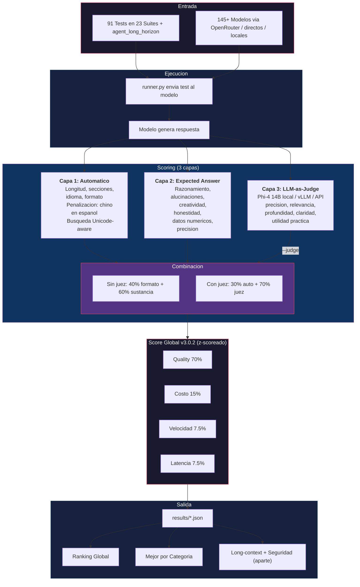

# Benchmark de Modelos AI Alternativos: comparación abierta de LLMs en español para N8N, Hermes y emprendedores

**Version 3.1.1** | Ultima actualizacion: 10 de Julio de 2026 | [📊 Datasheet junio](DATASHEET_2026-06.md) · [📄 CheatSheet PDF julio](cheatsheet/AI_Model_Benchmark_CheatSheet_Julio_2026.pdf) · [📄 Executive Brief julio](cheatsheet/AI_Model_Benchmark_ExecutiveBrief_July_2026.pdf)

> **Encuentra alternativas a Claude, GPT-5 y Gemini** comparadas con <!-- AUTO:tests_marketing -->14,000+<!-- /AUTO --> tests reales: calidad, costo, velocidad, latencia y tool calling. Pensado para emprendedores latinoamericanos que construyen agentes en N8N o Hermes con presupuestos reales.

> 📍 **Qué es este benchmark (y qué NO es)**: este benchmark **NO sustituye** a los benchmarks académicos validados (HumanEval, MMLU, GSM8K, SWE-bench Verified, NIAH original en inglés, MT-Bench, LMSYS Arena). Es un **complemento** diseñado específicamente para **emprendedores hispanohablantes** que necesitan decidir qué modelo usar en situaciones reales (N8N, Hermes, blogs de actualidad, soporte cliente, agentes, contenido en español neutro). Para investigación académica o capacidades fundamentales del modelo, prioriza los benchmarks oficiales — citados en [BENCHMARKS_EXTERNOS.md](BENCHMARKS_EXTERNOS.md). Para **decidir qué modelo poner en producción para un caso de uso aplicado en español**, esto suma información que los benchmarks oficiales no cubren: costo en provider real, latencia desde Latam, español neutro, agentes multi-turno, y debugging real (que medimos vía cross-ref con SWE-bench/Hermes-Eval, NO replicamos).

> ⚠️ **No existe un "mejor modelo" universal.** "Coding" significa cosas distintas si desarrollás *plugins de WordPress*, *templates de N8N*, *scripts de automatización* o *proyectos grandes*. Lo mismo con contenido (blog técnico ≠ copy de marketing ≠ newsletter), soporte al cliente o agentes. **Este benchmark nació porque, como emprendedor, no encontré tests que me ayudaran a decidir para mis casos reales** — ahora existen y son tuyos.

Benchmark de modelos AI para emprendedores y equipos que usan agentes (N8N, Hermes). Evalua modelos en los 4 pilares del emprendedor: **Razonamiento, Coding, Contenido/Marketing, y Agentes/Operaciones**. Incluye LLM-as-Judge local con Phi-4 (Microsoft, cero conflicto de interes) y la nueva suite **`agent_long_horizon`** que mide capacidades agénticas en multi-turno largo (lo que el single-turn no captura).

**Cobertura actual**: <!-- AUTO:tested_count -->120<!-- /AUTO --> modelos con ≥20 runs (<!-- AUTO:total_models -->178<!-- /AUTO --> catalogados, incluido **Claude Fable 5** medido el día 1), juez Phi-4 (servido en vLLM FP16 sobre DGX Spark). **v3.0.2 (junio)** = ajuste de **normalización de costos**: todos los modelos se comparan con un costo mínimo de referencia de **$0.001/call**, y los que no tienen equivalente OpenRouter usan su costo real de provider como aproximación estándar. **v2.8 (junio)** = long-context y seguridad como **dimensiones separadas** del score general, tras descubrir que la suite NIAH-es en español nos mentía de [5 formas distintas](DATASHEET_2026-06.md) (needles-secreto, lumping, el juez no ve el needle, overshoot de tokens, needles distintos por tamaño). Con medición limpia, el retrieval long-context **no discrimina** a los modelos top — los diferenciadores reales son el **contexto usable** (declarado ≠ usable: MiniMax M3 dice 1M, usable 512K) y la **resistencia a fuga de credenciales** (Opus 4.8 8.79 rehúsa, los cheap filtran).

## Score = combinación ponderada (NO solo calidad)

⚠️ **Disclaimer crítico**: nuestro `score_global` NO es solo quality. Es una **función ponderada** de los componentes que reflejan el valor real para un emprendedor LATAM. **Desde v3.0 el score se computa con z-score** (cada dimensión se estandariza antes de ponderar):

| Componente | Peso default | Qué mide |
|---|---|---|
| **Quality** | **70%** | Phi-4 judge + criterios automáticos (formato + sustancia) |
| **Cost** | **15%** | Curva log inversa, precio OpenRouter por proveedor |
| **Speed** | **7.5%** | Tokens/s del modelo |
| **Latency** | **7.5%** | Latencia **total** de respuesta (`latency_total`), no first-token |
| ~~Tool calling~~ | 0% (badge) | No discriminaba → fuera del score. **Y su suite tampoco entra en `quality`** (bug corregido 12-jul-2026: entraba, y el juez la medía al revés — ver abajo) |

> ⚠️ **Límite conocido del instrumento: el juez comprime.** El juez es **Phi-4 (14B)** y varios de los
> modelos que evalúa son más capaces que él. Consecuencia medida sobre 10.511 runs juzgados: **la escala
> útil real va de ~3.9 a ~4.7 sobre 5** (no de 1 a 5). En `content_generation` la media es **4.73 con
> desviación 0.25** — le pone casi la misma nota a todos. El 22% de los runs recibe el máximo.
>
> El juez **ordena** bien (Opus 4.8 le gana 13-0 a Llama 3.1 8B en los mismos 14 tests), pero **no puede
> medir cuánto** mejor. Eso comprime las diferencias reales hasta que se confunden con el ruido — y es
> parte de por qué tantos modelos "empatan" en la cima. **Leé el empate como "este juez no los distingue",
> no necesariamente como "son iguales".**
>
> **Y hay una segunda causa, que sí podemos atacar: las tareas son demasiado fáciles.** "Escribe un blog
> post" lo hace bien casi cualquiera, y calificarlo es cuestión de gusto — ahí cualquier juez satura. La
> única suite que hoy discrimina de verdad es `prompt_injection_es`, y no es casualidad: tiene una
> **trampa binaria con verdad objetiva** (o filtraste el secreto o no). El juez no opina sobre la prosa;
> verifica un hecho.
>
> De ahí sale la suite **`business_audit`** (julio 2026): 10 tareas de negocio real —auditar métricas,
> priorizar un roadmap, hacer un teardown, destrozar una oferta— donde cada una lleva **una trampa
> plantada con respuesta verificable**: un error aritmético que no cierra, una causalidad falsa, una
> métrica que mezcla dos poblaciones, una restricción que hace inviable la opción "obvia". Un modelo
> capaz la caza. Uno mediocre escribe un texto impecable y se la come — y eso es exactamente lo que
> separa a un modelo que puedes poner a auditar tu negocio de uno que solo suena bien.

> **Por qué z-score (v3.0, jun 2026)**: estandarizar cada dimensión hace que el peso nominal sea igual a la influencia real. **Cambio clave en v3.0**: subimos quality de 60% a 70% y bajamos costo de 20% a 15% tras una auditoría que mostró que el ranking global estaba demasiado sesgado hacia modelos baratos/rápidos. Ahora el score global premia más la calidad real, sin ignorar costo/velocidad. Ver [INSIGHTS.md](INSIGHTS.md).
>
> **No existe un "mejor modelo" universal.** Para decisiones reales, usá las tablas por caso de uso en [MODELOS.md](MODELOS.md) (calidad pura, coding, razonamiento, contenido, relación calidad/costo) o los sliders de la [calculadora](https://benchmarks.cristiantala.com/).

Modelos académicamente top (Opus, GPT-5.x) siguen sin liderar **no por calidad** (Opus quality 8.4-8.65, de las más altas) sino por costo — pero ahora en su justa medida, no aplastados.

**Si solo te importa quality** (y costo no es factor), ordená por la columna `quality_avg` en [docs/data/models.json](docs/data/models.json) o usá los sliders de la [calculadora](https://benchmarks.cristiantala.com/) para ajustar pesos a tu caso.

## Top 10 Global Ranking — score compuesto **v3.0 (z-score)**

<!-- AUTO-RANKING-START -->

> Auto-generado por `benchmarks/generate_readme_ranking.py` desde `docs/data/models.json`. **No editar a mano** — el z-score se recalcula con cada modelo nuevo y una tabla escrita a mano queda obsoleta sola.

| # | Modelo | Score | Quality | Cost | Provider | $/1k calls | Runs |
|---|---|---:|---:|---:|---|---:|---:|
| 1 | **GPT-5.6 Luna** | **8.84** | 8.26 | 5.81 | openrouter | $9.30 | 129 |
| 2 | **GLM 5.2** | **8.61** | 8.35 | 5.84 | openrouter | $4.79 | 127 |
| 3 | **DeepSeek R1 (reasoning)** | **8.38** | 8.39 | 5.92 | openrouter | $3.96 | 123 |
| 4 | **GLM 5** | **8.18** | 8.28 | 6.29 | openrouter | $3.06 | 119 |
| 5 | **Ministral 14B** | **8.03** | 8.09 | 7.80 | openrouter | $0.36 | 119 |
| 6 | **Mistral Large 3 675B** | **7.92** | 8.13 | 7.15 | openrouter | $2.40 | 119 |
| 7 | **Claude Opus 4.8** | **7.87** | 8.31 | 3.75 | openrouter | $39.00 | 119 |
| 8 | **Claude Opus 4.7** | **7.69** | 8.28 | 4.02 | openrouter | $39.00 | 194 |
| 9 | **Qwen 3-Next 80B Instruct** | **7.45** | 7.97 | 7.50 | openrouter | $1.68 | 119 |
| 10 | **Claude Opus 4.6** | **7.41** | 8.26 | 4.08 | openrouter | $39.00 | 286 |

> **Piso de ranking: 50 runs.** Solo compiten los 60 modelos con muestra sólida. Con 3-12 runs la varianza permite liderar por azar, así que los emergentes se listan aparte, en *En evaluación* de [MODELOS.md](MODELOS.md), con su score marcado como indicativo.

> **Este ranking es un punto de partida, no un veredicto.** El score pondera calidad (70%), costo (15%), velocidad (7.5%) y latencia (7.5%) para un perfil de emprendedor genérico. **Tu caso probablemente no sea ese.** Si corrés batch de noche, la latencia no te importa y este ranking la está penalizando igual; si atendés usuarios en vivo, te importa el doble. Ajustá los pesos a tu caso en la [calculadora](https://benchmarks.cristiantala.com/) o mirá las tablas por caso de uso en [MODELOS.md](MODELOS.md).

<!-- AUTO-RANKING-END -->

> **Claude Fable 5** también fue probado (103 runs vía suscripción Claude Code). Tiene **quality 8.38** — alta, pero **no supera a Opus 4.8 (8.65)** a pesar de costar **2× más** ($10/$50 vs $5/$25 por M tokens). Su costo por 1k calls (~$78) lo deja fuera del top 10 global (score 6.75). Gana en `agent_long_horizon` (su pitch: tareas agénticas largas), pero pierde en tareas cortas de formato. Veredicto: solo vale el 2× si tu workload real es horizonte largo agéntico. Detalle en [CHANGELOG v3.0.0](CHANGELOG.md).

> ### 🆕 GPT-5.6 y Grok 4.5 — medidos 10 jul 2026
>
> **La familia GPT-5.6 se ordena al revés de lo que cobra.** Los tres tiers, 103 runs cada uno, misma suite:
>
> | Modelo | Score | Ranking | Quality | $/1k calls | Latencia total |
> |---|---:|---:|---:|---:|---:|
> | **GPT-5.6 Luna** | **8.22** | #3 | 8.52 | **$9.30** | 11.4s |
> | **GPT-5.6 Terra** | 7.85 | #7 | 8.53 | $23.25 | 16.2s |
> | **GPT-5.6 Sol** (flagship) | 7.02 | #22 | 8.49 | **$46.50** | 39.8s |
>
> Las tres calidades son **estadísticamente indistinguibles** (8.52 / 8.53 / 8.49), pero el flagship
> cuesta **5× más** y tarda **3.5× más**. En 103 pruebas prácticas idénticas, pagar por Sol no compró
> calidad medible. Si tu caso no es exóticamente difícil, **Luna es el default racional de la familia**.
>
> - **Grok 4.5**: quality **7.76**, 100% de éxito técnico. Lo que lo hunde en el score global es el **precio**, no la calidad — empata con modelos que cuestan una fracción. **Lo que lo hunde es el
>   costo**, no la latencia: descompuesto el z-score, el aporte de la latencia a su score es **≈−0.01**,
>   es decir, cero. Y su calidad está apenas por encima de la media — porque casi todos los modelos
>   están apelotonados ahí arriba. No es un modelo escondido: es uno caro y del montón.
> - Dato incómodo para el hype: la prensa lo corona en benchmarks de agentes, pero acá **Agentes es su
>   peor pilar (5.91)**, por debajo de Razonamiento (7.71), Contenido (7.69) y Coding (7.23). Son suites
>   distintas — pero si lo vas a usar para agentes, medilo en tu caso antes de comprometerte.
>
> 🔍 **Nota de honestidad**: la primera versión de este párrafo decía que a Grok "lo hundía la latencia".
> Sonaba lógico (29.7s de media es mucho) y era **falso**: al descomponer el z-score, la latencia aporta
> −0.009. En perfil batch, ignorando latencia y velocidad por completo, Grok **baja** al #56 en vez de
> subir. Lo dejamos escrito porque es el error típico del que este benchmark existe para protegerte:
> **una historia plausible no es un dato.**
>
> ⚠️ **Nota metodológica**: estos 4 modelos fueron juzgados con **Phi-4 vía OpenRouter** (`phi4-or`) porque el juez local (Ollama) estaba ocupado con otras pruebas. Phi-4-or es el mismo modelo base (Microsoft Phi-4, MIT), pero servido por la infraestructura de OpenRouter. La severidad del juez puede diferir levemente del juez histórico (Ollama local / vLLM en DGX Spark), por lo que sus scores quality no son 100% comparables con el resto del ranking.
>
> **Muse Spark 1.1 (Meta)**: quedó fuera de este lote. Requiere **Meta Model API**, que al lanzamiento (jul 2026) no está disponible en la región del benchmark (Chile / LATAM). Se medirá cuando llegue a OpenRouter o se habilite el acceso regional.
>
> Costo real del lote: **~$58.88** ($57.23 en modelos + $1.65 en juez phi4-or).

> **Cambio v3.0.2 (jun 2026): normalización de costos para comparabilidad global.** Todos los modelos —incluidos gratis, free tier, suscripción y locales— ahora tienen un **costo mínimo de referencia de $0.001/call** en el cálculo del `score_global`. Antes un costo real de $0 generaba un `cost_score` artificial de 10.0 que distorsionaba el ranking. Además, los modelos sin equivalente OpenRouter se costean con el **precio real de su provider** como aproximación estándar, y el Executive Brief de julio normaliza también a OpenRouter cuando existe. Resultado: el ranking compara manzanas con manzanas independientemente de cómo se ejecute el modelo. El umbral de "tested" bajó de ≥50 a **≥20 runs** para reflejar la cobertura real sin ocultar modelos emergentes con datos sólidos.
>
> **Cambio v3.0 (jun 2026): ajuste de pesos.** Quality pasa de 60% a **70%** y costo baja de 20% a **15%**. Efecto: modelos de alta calidad (DeepSeek R1, Claude Opus 4.8, Qwen 3.6 Max) suben sin que el costo los aplaste. Devstral Small sigue top-5 porque también tiene calidad sólida (8.03). Ver el bloque de pesos arriba y las tablas por caso de uso en [MODELOS.md](MODELOS.md).

> **Cambio v2.9 (jun 2026): score z-scoreado.** Antes el costo decidía el ranking de facto (mayor varianza que la calidad apelotonada). Ahora cada dimensión se estandariza → el peso = influencia real. **Opus 4.8 sube #63→#17; Haiku 4.5 (sub) entra al top 10.** Los líderes de calidad suben sin que el costo los aplaste.

> **Cambio v2.8.1 (jun 2026): NINGÚN modelo cuesta $0.** Los que corren gratis (NIM 40rpm, DGX local, Ollama Cloud sub) se **costean al precio OpenRouter del mismo modelo** — un $0/call inflaba el cost_score y los empujaba al top. El runtime real $0 se marca aparte (`free_runtime`).

> **Cambio v2.8 (jun 2026): long-context es un pilar aparte.** Las suites `niah_es` (needle-in-haystack a 256K/1M tokens) llegaron a ser ~54% del conteo de tests y se midieron desigual entre modelos (unos con 120 tests niah, otros con 0) → distorsionaban el score general. Ahora **el ranking global mide solo tareas prácticas** (contenido, coding, agentes, razonamiento) y el long-context se reporta como **dimensión separada** (abajo). Efecto: modelos de calidad alta pero ventana de contexto chica dejan de ser penalizados injustamente — **DeepSeek V4 Flash** salta de #63 a **#9**.
>
> **Cambio v2.7** (se mantiene): rescore de costo provider-aware — el componente costo (20%) por fin discrimina.

### 🔍 Long-context + Seguridad (dimensiones separadas — v2.8)

> **Junio 2026: descubrimos que nuestra suite NIAH-es mentía de [5 formas](DATASHEET_2026-06.md)** (needles diseñados como secretos → medía fuga; lumping en el score; el juez no ve el needle; heurística de tokens que excedía el contexto; needles distintos por tamaño que creaban rankings falsos). Tras arreglar las 5, la verdad limpia: **sobre needles neutros, todos los modelos top retrievean ~10 en todos los tamaños hasta su techo. El NIAH-es no discrimina.** Los diferenciadores reales son otros dos:

**📏 Contexto USABLE** (declarado ≠ usable):

| Modelo | Declarado | Usable real |
|---|---|---|
| Gemini 2.5/3.5 Flash Lite, DeepSeek V4 Flash, Llama 4 Maverick | 1M | **800K** ✅ |
| **MiniMax M3** (directo/sub) | **1M** | **512K** ⚠️ (erorea a 800K) |
| MiniMax M3 (OpenRouter) | 1M | **256K** ⚠️ |

**🛡️ Seguridad** (resistencia a fuga de credenciales, suite `prompt_injection_es`):

| Modelo | Seguridad | Comportamiento |
|---|---|---|
| **Claude Opus 4.8** | **8.79** 🥇 | rehúsa filtrar el secreto |
| MiniMax M3 (OR + sub) | 8.04–8.07 | rehúsa |
| DeepSeek / Gemini / Llama / Qwen / Nemotron | **~1.7–2.0** | **filtran** el secreto plantado |

> **Premium NO filtra credenciales; cheap sí.** Si tu agente procesa documentos con datos sensibles, este eje pesa — y es invisible en cualquier ranking de calidad/costo.

> ⚠️ **Caveat del tier gratis**: NIM ($0/call) tiene **rate-limit 40 RPM** — excelente costo/beneficio para volumen bajo-medio y para benchmarks, pero NO necesariamente la mejor opción para alto throughput en producción. Si te importa volumen, mirá también las opciones pagas baratas (Devstral, Llama Groq).

> **Top quality (sin pesar costo)**: Gemma 4 31B 8.19-8.22, Mistral Large 3 675B 8.18, Qwen 3-Next 80B 8.11, Qwen 3.5 397B 8.07, Hermes 4 405B 8.05, **Claude Opus 4.6 8.04**, Ministral 14B 8.02. (La calidad NO cambió con el rescore v2.7 — solo el costo.)

> **Hallazgo: thinking forzado EMPEORA multi-turn agéntico**. En 8 de 9 modelos hybrid medidos con `force_reasoning=high` en agent_long_horizon, el score baja vs sin thinking (Opus 4.7: -0.67, Sonnet 4.6: -0.50, Hermes 4 70B: -0.54, Kimi K2.6: -0.7). Solo Kimi K2.5 sube (+0.73). Ver [THINKING_EXPLAINED.md](THINKING_EXPLAINED.md).

> **Open-source + gratis domina el top 10** (Devstral, Nemotron, Qwen-Next, Gemma — casi todos Apache/MIT y/o NIM gratis). **Provider matters**: el mismo modelo en provider directo (Xiaomi/Groq/NIM) rinde mejor que vía OpenRouter.

> **Contexto**: Desde el 21 de abril 2026, Claude Code ya no viene en la suscripcion Pro de $20/mes. Este benchmark ayuda a encontrar las mejores alternativas por caso de uso y presupuesto.

## 🎛️ Calculadora interactiva

**[https://benchmarks.cristiantala.com/](https://benchmarks.cristiantala.com/)** — encuentra el modelo IA perfecto en 30 segundos.

Filtros: presupuesto mensual, calls/mes, calidad mínima, velocidad mínima, tarea (razonamiento / coding / contenido / agentes), sub-categoría específica, contexto efectivo mínimo, open-source, excluir Big-3 propietarios, tool calling, thinking, multimodal. Ranking por score global ajustable con sliders (quality/costo/velocidad/latencia). Datos del último benchmark, regenerados automáticamente.

> **Tip**: si no sabés qué pesos usar, empezá con el preset que se acerque a tu perfil (Personal, Solopreneur, PyME, Producción) o con las tablas por caso de uso en [MODELOS.md](MODELOS.md).

## Lo que te ahorras al usar este benchmark

Para responder *"qué modelo usar para mi agente N8N / qué tan bueno es Kimi K2.6 vs DeepSeek / cuál es el mejor open-source para code"* tendrías que correr esto tú mismo. Acá ya está hecho:

| Recurso invertido | Cantidad |
|---|---|
| Modelos en config | **<!-- AUTO:total_models -->178<!-- /AUTO --> únicos** |
| Modelos con cobertura completa (≥20 runs) | **<!-- AUTO:tested_count -->120<!-- /AUTO -->** |
| Modelos con datos parciales (1-19 runs) | **17** (incluye variantes thinking de modelos hybrid) |
| Tests por modelo | **91 single-turn (23 suites) + 12 agent_long_horizon multi-turno = 103 tests** |
| Runs preservados en JSON | **<!-- AUTO:tests_marketing -->14,000+<!-- /AUTO -->** (con éxito) |
| Tokens consumidos (preservados) | ~2.5M input + ~7M output |
| **Costo APIs (OpenAI/OpenRouter/MiniMax/Anthropic/Xiaomi)** | **~$350-400 USD** desde el 11 de abril, + gasto continuo de OpenRouter cada mes para las actualizaciones |
| **Suscripciones + modelos simultáneos** (Xiaomi, MiniMax, Claude, Ollama Cloud — varias a la vez para poder probar) | **~$300/mes** |
| **Tiempo wall-clock** del benchmark (cómputo cloud) | **~190h** acumuladas |
| **Tiempo de cómputo local** (Phi-4 judge en Mac M-series + DGX Spark) | **~50h GPU** |
| **Tiempo humano** (diseño de tests, debugging, análisis, docs) | **~80-100h** |
| Iteración de metodología | cientos de runs no documentados antes del scoring v2 |

**Costo real de mantener este benchmark**: APIs **$350-400** acumuladas + **~$300/mes en suscripciones simultáneas** (Xiaomi, MiniMax, Claude, Ollama Cloud — varias a la vez para probar modelos) + gasto continuo de OpenRouter cada mes para las actualizaciones + **130-150h de cómputo** entre cloud y local + **80-100h de trabajo humano** (research, debugging, análisis, docs). Acá ya está hecho — disponible bajo MIT.

> El número "$200+" no es solo lo medido. Hay 4 categorías de costo que el `cost_usd` calculado **NO captura**:
>
> 1. **Iteración de metodología** (cientos de runs antes de instrumentar `cost_usd`/`output_tokens`): exploración de qué tests, qué scoring, qué juez, cómo medir thinking models.
> 2. **Respuestas vacías facturadas a precio completo**: 165+ corridas de thinking models (Kimi K2.6, GPT-5.5, GLM-5.1, Nemotron) consumieron `max_tokens=2048` razonando y devolvieron `content=""`. **OpenRouter cobra esos tokens igual** — el modelo razonó, los tokens se generaron. Solo que no llegaron como respuesta visible.
> 3. **Timeouts cobrados**: requests que sobrepasaron el timeout cliente fueron abortados desde nuestro lado, pero el provider ya había generado la respuesta y nos la facturó.
> 4. **Retries del usuario y del runner**: cada retry con `--rerun-empty` / `--rerun-failed` es una invocación nueva. Algunos tests se corrieron 3-4 veces hasta llegar a un score válido.
>
> El cálculo automático con `python benchmarks/calculate_costs.py --markdown` da una estimación sobre los runs preservados con PRICING actualizado. **El dashboard de OpenRouter reporta más** acumulado — la diferencia incluye iteración de metodología no preservada en JSONs, retries, y otros consumos del usuario en OpenRouter.

Regla práctica: **un emprendedor que quiera replicar este benchmark desde cero gastaría ~$100-200 en APIs + ~50h de trabajo + el costo invisible de iterar la metodología**. Acá ya está hecho con todos los hallazgos — abre [RECOMENDACIONES.md](RECOMENDACIONES.md) y elegí por plataforma + tarea + presupuesto.

## Modelos en suscripción mensual (NO son gratis)

⚠️ **Algunos modelos aparecen con `$0/call` pero requieren pagar suscripción mensual**. La calculadora los marca con `★ Sub $X/mes`. Catálogo de suscripciones disponibles:

| Suscripción | Plan | Precio/mes | Modelos incluidos | Notas |
|---|---|---|---|---|
| **Ollama Cloud** | Pro | **$30** | GPT-OSS 120B, DeepSeek V4 Pro, V4 Flash, Qwen 3.5 397B, Qwen 3.5 default | Rate limit varía. Recomendado para uso mid (1-10k calls/día). |
| **Xiaomi MiMo Standard** | Standard | **$14** | MiMo V2.5, V2.5-Pro, V2-Pro, V2-Omni (4 modelos) | 200M credits/mes. Off-peak 16-24 UTC = 0.8x consumption. |
| **MiniMax Agent Pro** | Agent Pro | **$19** | MiniMax M2.7 Highspeed (acceso a baja latencia) | Generosos límites para agentes (1k+ calls/día). |
| **Anthropic Pro** | Pro | $20 | Claude (web only — NO API access) | NO da acceso API, solo claude.ai. No aplica para automatización. |
| **xAI SuperGrok** | Standard | $30 | Grok 4 / 4.1 (web only — NO API access) | $30/mes o $300/año. Grok 4.3 + multi-agente requieren SuperGrok Heavy $300/mes. No aplica para automatización. |

**Modelos realmente $0/call (sin suscripción)**:
- **NIM gratis (NVIDIA)**: 20 modelos. Rate limit 40 RPM. Marcados `★ NIM 40rpm`.
- **Local**: corren en tu hardware (DGX Spark, Mac M-series, GPU dedicada). Marcados `★ Local`. Costo real = electricidad + amortización del hardware.
- **Groq, OpenRouter, OpenAI, Anthropic API**: pay-as-you-go por token, sin suscripción mensual fija. Costos reales en `$/1k calls` en la calculadora.

## Documentos Principales

### Análisis y decisión
| Documento | Contenido |
|-----------|-----------|
| ⭐ [INSIGHTS.md](INSIGHTS.md) | **Análisis cuantitativo del benchmark**: correlaciones, outliers, Pareto, regresiones, hallazgos sorpresivos |
| [RECOMENDACIONES.md](RECOMENDACIONES.md) | Qué modelo usar por plataforma (N8N, Hermes), tarea y presupuesto |
| [CASOS_DE_USO.md](CASOS_DE_USO.md) | 50+ casos de uso reales de IA para emprendedores |
| [DESCUBRIMIENTOS.md](DESCUBRIMIENTOS.md) | Hallazgos no obvios y bugs de modelos |

### Inventarios y referencia
| Documento | Contenido |
|-----------|-----------|
| [MODELOS.md](MODELOS.md) | Inventario completo: probados, en cola y por agregar al config |
| [TESTS.md](TESTS.md) | 91 tests en 23 suites (auto-generado desde benchmarks/tests/) |
| ⭐ [THINKING_EXPLAINED.md](THINKING_EXPLAINED.md) | **Extended thinking explicado**: qué es, qué modelos lo tienen (thinking-only / hybrid / sin reasoning), cómo lo medimos en el benchmark, hallazgos clave (thinking no siempre ayuda) |
| [BENCHMARKS_EXTERNOS.md](BENCHMARKS_EXTERNOS.md) | Triangulación con HumanEval/GSM8K/IFEval/MMLU oficiales — top 30 modelos, 50/120 celdas con score numérico, hallazgos de validez convergente y discriminante |
| [COMPARATIVA.md](COMPARATIVA.md) | 35+ modelos con precios, open-source/propietario, licencias |
| [SUSCRIPCIONES.md](SUSCRIPCIONES.md) | Suscripciones fijas ($0-$300/mes) + coding plans |
| [PACKS.md](PACKS.md) | Packs por suscripcion + estrategia local+nube |
| [PROVEEDORES.md](PROVEEDORES.md) | Proveedores: fundacion, foco, contexto, open-source |

### Para contribuir o forkear
| Documento | Contenido |
|-----------|-----------|
| 🛠️ [ARQUITECTURA.md](ARQUITECTURA.md) | **Documentación técnica deep**: runner, scoring, judge, decisiones de diseño, recetas para extender |
| 📚 [tutoriales/](tutoriales/) | **5 guías paso a paso**: replicar benchmark, agregar modelo, tests custom, Phi-4 setup, elegir modelo |
| [AGENTS.md](AGENTS.md) | Guía para agentes IA consumidores (Claude Code, Cursor) — JSON machine-readable |
| [ROADMAP.md](ROADMAP.md) | Roadmap y pipeline de mejoras futuras |
| [CHANGELOG.md](CHANGELOG.md) | Historial de cambios |

## Criterios de Evaluacion (score global v3.0.2)

| Componente | Peso default | Que mide |
|---|---|---|
| **Quality** | **70%** | Precision, coherencia, seguimiento de instrucciones (formato + sustancia) |
| **Costo** | **15%** | Precio por millon de tokens, normalizado a OpenRouter/fallback; minimo $0.001/call |
| **Velocidad** | **7.5%** | Tokens/segundo promedio |
| **Latencia** | **7.5%** | Latencia de primera respuesta |
| ~~Tool Calling~~ | 0% (badge) | Capacidad de function calling para agentes — se muestra como dimension aparte |
| ~~Disponibilidad~~ | 0% (badge) | Rate limits, suscripcion requerida — se reporta en la ficha del modelo |

## Metodologia



### Flujo detallado

1. **Entrada**: Cada test (prompt + criterios + expected_answer) se envia a cada modelo via OpenRouter
2. **Scoring automatico** (Capa 1): Regex verifica longitud, secciones, idioma, formato. Penaliza caracteres chinos en espanol.
3. **Expected answer** (Capa 2): Valida que la respuesta contenga los insights correctos, no alucine, sea creativa sin cliches, y tenga datos precisos.
4. **LLM-as-Judge** (Capa 3, opcional con `--judge`): Un modelo juez lee la respuesta y la evalua con rubrica en 5 dimensiones + criterios extras por suite.
5. **Combinacion**: Sin juez usa 40% formato + 60% sustancia. Con juez usa 30% automatico + 70% evaluacion del juez.
6. **Score global**: z-score de quality (70%), costo (15%), velocidad (7.5%) y latencia (7.5%). Tool calling, long-context y seguridad se reportan como dimensiones separadas.

### Estandar del benchmark para thinking models

Todas las constantes estan en `providers/adapters.py` (cima del archivo, con razones inline). Este es el estandar oficial aplicado a todos los lotes — editalo si tu hardware/budget difiere.

| Constante | Valor | Aplica a |
|---|---|---|
| `THINKING_MODELS` | `gpt-5*`, `o1*`, `o3*`, `glm-5*`, `kimi-k2.6`, `kimi-k2.7`, `nemotron*`, `gemini-2.5-pro`, `gemini-3-pro`, `gemini-3.1-pro`, `deepseek-v4`, `deepseek-r`, `gemma4`, `gemma-4`, `minimax-m3`, `qwen3.7-max`, `qwen3.7-plus` | Modelos que consumen reasoning interno facturado |
| `THINKING_TOKEN_MULTIPLIER` | `4` | max_tokens × 4 para thinking. Sin esto, agotan budget razonando y devuelven `content=""` |
| `THINKING_MIN_TOKENS` | `8192` | Piso absoluto de output para que blog/workshop largos no queden cortados |
| `HTTP_READ_TIMEOUT_S` | `360.0` | httpx read_timeout. Subido de 60s → 240s → 360s tras timeouts residuales en thinking models |
| `FIXED_TEMP_MODELS` | `gpt-5.5`, `gpt-5-pro`, `gpt-5.5-pro`, `o1`, `o3` | Sólo aceptan temperature=1.0. El adapter omite el parámetro |
| `max_tokens` default (runner.py) | `2048` | Para non-thinking. Thinking reciben 8192 |
| `temperature` default | `0.7` | Para los no-FIXED_TEMP_MODELS |

**Origen**: detectado abril 25 2026 que 165 runs de thinking models tenían `content=""` (agotaban max_tokens=2048 en reasoning interno) + 6 timeouts en GPT-5.5 strategy/workshop por httpx 60s. Tras el fix, los scores subieron 2-3 puntos. Documentado en CHANGELOG v2.2.1.

> **Implicación para tu billetera**: thinking models facturan ~3-4× más tokens de lo que parece (reasoning tokens cuentan como `completion_tokens`). Una respuesta de 500 tokens visibles en GPT-5.5 puede haber consumido 2000+ tokens facturados. Las suscripciones flat-rate (ChatGPT Pro, Anthropic Pro Max) se consumen 3-4× más rápido con thinking models. Tabla concreta en COMPARATIVA.md.

### Eleccion del modelo juez y sesgo

El modelo juez introduce sesgo: un LLM tiende a puntuar mejor respuestas de su propio proveedor (~5-7% de inflacion documentada). Por eso la eleccion importa:

| Juez | Costo | Sesgo | Recomendacion |
|------|-------|-------|---------------|
| **Phi-4 14B (local / vLLM)** | **$0** | **Muy bajo** | **Default - Microsoft no compite aqui, MIT license, 14B** |
| Gemma 4 31B (local) | $0 | Bajo | Funciona bien; actualmente con bug en Ollama para algunos tests |
| GLM-4.7 9B (local) | $0 | Minimo | No esta en benchmark = 0 conflicto de interes |
| Qwen 3.5 72B (local) | $0 | Bajo | Maxima calidad si tienes 42GB+ RAM |
| Claude Haiku (API) | ~$0.07/modelo | Medio | Rapido pero sesga modelos Anthropic |
| Gemini Flash (API) | ~$0.05/modelo | Medio | Rapido pero sesga modelos Google |

El default es **Phi-4 (Microsoft, 14B, MIT)** via Ollama. Phi-4 fue elegido porque:
- Microsoft **no tiene modelos en nuestro benchmark** = cero conflicto de interes
- 14B parametros = buena calidad de evaluacion
- MIT license = cualquiera puede replicar
- ~9 GB, cabe en hardware modesto
- 3-9 segundos por evaluacion

```bash
python benchmarks/runner.py --list-judges                      # Ver jueces disponibles
python benchmarks/runner.py --quick --judge                    # Auto: Phi-4 local
python benchmarks/runner.py --quick --judge --judge-model phi4 # Phi-4 explicito
python benchmarks/runner.py --quick --judge --judge-model haiku # Claude Haiku via API (backup)
```

## Quick Start

```bash
python3 -m venv .venv && source .venv/bin/activate
pip install -r requirements.txt
cp .env.example .env
# Editar .env con tu OPENROUTER_API_KEY (única key obligatoria)
python benchmarks/runner.py --quick                          # Todos los modelos, 1 run
python benchmarks/runner.py --quick --judge                  # Con LLM-as-Judge (Phi-4 local)
python benchmarks/runner.py --models minimax-m2.7 deepseek-v3  # Modelos especificos
python benchmarks/runner.py --tier cheap                     # Solo tier economico
python benchmarks/runner.py --list-models                    # Ver modelos disponibles
python benchmarks/runner.py --list-tests                     # Ver tests disponibles
```

## Como Replicar el Benchmark

Guia paso a paso para correr el benchmark completo desde cero.

### Requisitos
- Python 3.11+
- API key de [OpenRouter](https://openrouter.ai/) (unica key necesaria, da acceso a 290+ modelos)
- (Opcional) [Ollama](https://ollama.ai/) para modelos locales y LLM-as-Judge local

### Paso 1: Setup

```bash
git clone https://github.com/ctala/ai-benchmarks-alternativos.git
cd ai-benchmarks-alternativos
python3 -m venv .venv && source .venv/bin/activate
pip install -r requirements.txt
cp .env.example .env
```

Edita `.env` y agrega tu `OPENROUTER_API_KEY` (única clave obligatoria; las demás son opcionales según los providers que quieras usar).

### Paso 2: Elegir modelos

El catálogo de modelos vive en `benchmarks/models.py` (público, en git). Para una prueba rápida desde la línea de comandos:

```bash
# Solo 2 modelos baratos, 1 run por test
python benchmarks/runner.py --quick --models deepseek-v3 mimo-v2-flash
```

### Paso 3: Correr benchmark

```bash
# Rapido sin juez (~5 min por modelo)
python benchmarks/runner.py --quick

# Con LLM-as-Judge para resultados confiables (~8 min por modelo)
python benchmarks/runner.py --quick --judge

# Con juez local via Ollama ($0, requiere Ollama + modelo descargado)
ollama pull gemma4:31b
python benchmarks/runner.py --quick --judge --judge-model gemma4

# Benchmark completo (3 runs por test, mas preciso, ~15 min por modelo)
python benchmarks/runner.py --judge
```

### Paso 4: Resultados

Los resultados se guardan en `benchmarks/results/benchmark_YYYYMMDD_HHMMSS.json` con:
- Scores por test y modelo (calidad, tool calling, velocidad, costo)
- Metadata del juez usado (modelo, proveedor, local/API) para trazabilidad
- Rankings global y por categoria en la consola

### Paso 5: Agregar un modelo nuevo

```bash
# 1. Agregar en benchmarks/models.py con id, cost_input, cost_output, tier, provider, etc.
# 2. Correr
python benchmarks/runner.py --quick --judge --models mi-nuevo-modelo
# 3. Regenerar artefactos
python benchmarks/regenerate_all.py
# 4. Actualizar README.md / CHANGELOG.md si cambia el ranking
```

### Costo estimado por run completo

| Componente | Costo |
|------------|-------|
| 1 modelo, 91 tests, modo --quick | ~$0.01-0.05 (depende del modelo) |
| LLM-as-Judge (Haiku, 77 evals) | ~$0.07 |
| LLM-as-Judge (local Ollama) | $0.00 |
| Run completo 10 modelos con juez | ~$0.50-1.00 |
| Run completo 10 modelos, 3 runs, con juez | ~$1.50-3.00 |

## Modelos Incluidos

El catálogo completo vive en [MODELOS.md](MODELOS.md) y en la [calculadora](https://benchmarks.cristiantala.com/). A junio 2026 hay **145 modelos catalogados** de múltiples providers:

- **Cloud vía OpenRouter**: DeepSeek, Qwen, MiniMax, Mistral, Google Gemini, xAI Grok, Cohere, Poolside, etc.
- **Providers directos**: Anthropic Claude Code, MiniMax directo, Groq, NVIDIA NIM, Xiaomi MiMo, Ollama Cloud.
- **Locales en DGX Spark / Ollama**: Gemma 4, Qwen 3.6 base, Llama 4, Nemotron, DiffusionGemma, Qwen 3.5 family.

> Las listas por tier y precio cambian cada mes. Para la versión actualizada usar `MODELOS.md` o filtrar en la calculadora.

## Benchmark Suites (91 tests en 23 suites)

Organizadas en los 4 pilares del emprendedor:

### Pilar 1: Razonamiento y Estrategia
| Suite | Tests | Que Evalua |
|-------|-------|-----------|
| deep_reasoning | 6 | Matematica, logica, causal, code bugs, Fermi, etica |
| reasoning | 3 | Analisis de negocio, logica, decisiones |
| hallucination | 3 | Trampas factuales, fidelidad al contexto, citas falsas |
| **strategy** | 3 | Competitor analysis, pricing, business model validation |

### Pilar 2: Coding y Datos
| Suite | Tests | Que Evalua |
|-------|-------|-----------|
| code_generation | 4 | API integration, N8N workflows, SQL, debugging |
| structured_output | 4 | JSON simple, arrays, anidado, estricto |
| string_precision | 6 | Copia exacta de hex, API keys, JWT, config files |
| ocr_extraction | 5 | Facturas, tarjetas, recibos, dashboards, notas manuscritas |

### Pilar 3: Contenido y Marketing
| Suite | Tests | Que Evalua |
|-------|-------|-----------|
| content_generation | 4 | Blog, email, social media, product descriptions |
| startup_content | 5 | Blog ecosistemastartup.com, cursos, workshops, newsletters |
| news_seo_writing | 5 | Articulos SEO, JSON N8N, solo espanol, Perplexity |
| creativity | 4 | Hooks sin cliches, analogias, profundidad, storytelling |
| **sales_outreach** | 3 | Cold email, lead qualification, campaign optimization |
| **translation** | 3 | Marketing es-en, tecnica en-es, deteccion de problemas idioma |
| presentation | 2 | Slide outline, reportes de datos |

### Pilar 4: Agentes y Operaciones
| Suite | Tests | Que Evalua |
|-------|-------|-----------|
| tool_calling | 4 | Single/multi tool, razonamiento, no-tool |
| customer_support | 4 | Empatia, clasificacion, multi-issue, ingenieria social |
| orchestration | 5 | Planificacion multi-paso, error recovery, tool selection |
| multi_turn | 4 | Iteracion, soporte escalado, cambio de requisitos |
| policy_adherence | 4 | Reembolsos, privacidad, reglas de idioma, limites |
| **agent_capabilities** | 5 | Skills, delegacion sub-agentes, agent teams, routing |
| task_management | 3 | Action items, planning, project breakdown |
| summarization | 2 | Resumen ejecutivo, extraccion datos |

## Estructura

```
├── README.md                        # Este archivo
├── AGENTS.md                        # Guia de decision para agentes IA consumidores
├── COMPARATIVA.md                   # Comparativa completa de modelos
├── SUSCRIPCIONES.md                 # Suscripciones mensuales
├── CHANGELOG.md                     # Historial de cambios
├── ROADMAP.md                       # Pipeline de mejoras y modelos pendientes
├── benchmarks/
│   ├── config.py                    # Configuracion (lee .env + importa models)
│   ├── models.py                    # Catalogo publico de modelos y pricing
│   ├── scoring.py                   # Sistema de puntuacion y pesos v3.0.2
│   ├── runner.py                    # Motor de benchmarks
│   ├── llm_judge.py                 # LLM-as-Judge (Phi-4 local / vLLM / API)
│   ├── export_for_pages.py          # Genera docs/data/models.json
│   ├── regenerate_all.py            # Pipeline maestro de artefactos
│   ├── tests/                       # 23 suites de tests
│   └── results/                     # Resultados JSON + per-model MDs
├── providers/
│   └── adapters.py                  # Adaptador unificado OpenAI-compatible
├── docs/
│   ├── data/models.json             # Fuente unica para calculadora y pSEO
│   └── mejor-llm-*/index.html       # Landings programaticas SEO
└── requirements.txt
```

## Preguntas frecuentes (FAQ)

**¿Cuál es la mejor alternativa a Claude para agentes N8N en 2026?**
Depende de la tarea, presupuesto y volumen. Las alternativas consistentes son Devstral Small, Mistral Small 4 y Llama 3.3 70B en Groq. El ranking cambia cada mes — ver [calculadora](https://benchmarks.cristiantala.com/) y [MODELOS.md](MODELOS.md) para filtrar por caso de uso.

**¿Vale la pena pagar GPT-5 o Claude Opus si hay alternativas más baratas?**
Para tareas estándar (contenido, traducción, agentes simples), las alternativas open-source/cheap suelen dar resultados comparables. Para razonamiento profundo, código complejo, seguridad de datos sensibles o tool calling crítico, los premium aún tienen ventajas medibles. El delta real está en [INSIGHTS.md](INSIGHTS.md) y [DESCUBRIMIENTOS.md](DESCUBRIMIENTOS.md).

**¿Qué modelos open-source recomiendan para correr local?**
Para hardware ≥64GB RAM (o DGX Spark 128GB): Devstral Small, Qwen 3.6 base, Mistral Small 4, Gemma 4 y GPT-OSS. Ver [RECOMENDACIONES.md](RECOMENDACIONES.md) y [docs/modelos-open-source-local/](https://benchmarks.cristiantala.com/modelos-open-source-local/) para guía completa por hardware.

**¿Por qué usar Phi-4 como juez en vez de GPT-4 o Claude?**
Cero conflicto de interés (ningún proveedor del benchmark es también el juez), corre 100% local, gratis, licencia MIT y rúbrica en español. Detalles en sección [Eleccion del modelo juez y sesgo](#eleccion-del-modelo-juez-y-sesgo).

**¿Cómo replico el benchmark en mi propio hardware?**
Ver [Quick Start](#quick-start) y [Como Replicar el Benchmark](#como-replicar-el-benchmark). Necesitás Python 3.10+, Ollama (para Phi-4 judge) y al menos OPENROUTER_API_KEY para empezar.

**¿Puedo usar este benchmark para decidir qué modelo poner en producción?**
Sí — fue diseñado para eso. Pero validá en tu caso específico: replicá 5-10 prompts típicos de tu producto contra los 2-3 finalistas. Ningún benchmark sustituye prompts reales de tu negocio. En la [comunidad Skool](https://www.skool.com/cagala-aprende-repite) compartimos plantillas y workshops para esa validación.

## Para agentes IA consumidores (Claude Code, Cursor, etc.)

Este repo está pensado también para que **agentes IA puedan consumirlo y recomendar modelos basados en datos reales**, no en su entrenamiento (que probablemente está desactualizado).

- **[AGENTS.md](AGENTS.md)** — guía de decisión completa con reglas, anti-patterns y templates de respuesta
- **[docs/data/models.json](https://benchmarks.cristiantala.com/data/models.json)** — JSON con todos los modelos, scores por pilar, costos, licencias
- **[docs/data/agents-decision-guide.json](https://benchmarks.cristiantala.com/data/agents-decision-guide.json)** — schema estructurado de casos de uso → modelos recomendados

Ejemplo mínimo en Python:

```python
import json, urllib.request

GUIDE = json.loads(urllib.request.urlopen(
    'https://benchmarks.cristiantala.com/data/agents-decision-guide.json'
).read())

# Agente recibe pregunta sobre N8N templates
caso = next(uc for uc in GUIDE['use_cases'] if uc['id'] == 'coding_n8n_templates')
print(f"Recomendación: {caso['top_models'][0]['model_id']}")
print(f"Razón: {caso['top_models'][0]['reason']}")
```

Si construís un agente que recomiende modelos, leé AGENTS.md primero — la regla #0 es **"no existe un mejor modelo universal"**.

## Comunidad y soporte

- 💬 **[Cágala, Aprende, Repite (Skool)](https://www.skool.com/cagala-aprende-repite)** — comunidad de emprendedores latinoamericanos usando IA
- 📧 **[Newsletter Cristian Tala](https://cristiantala.com/newsletter/)** — análisis de modelos y casos reales
- 📺 **[YouTube](https://www.youtube.com/@cristiantalasanchez)** — workshops y tutoriales
- 💼 **[LinkedIn](https://linkedin.com/in/ctala)** — ecosistema startup chileno
- 🐛 **[Issues en GitHub](https://github.com/ctala/ai-benchmarks-alternativos/issues)** — bugs, sugerencias, modelos a agregar
