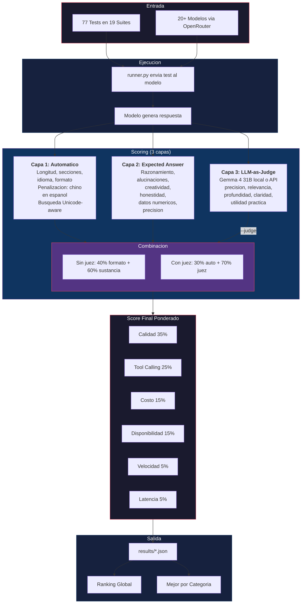

# Benchmark de Modelos AI Alternativos

**Version 2.0.0** | Ultima actualizacion: 22 de Abril de 2026

Benchmark de modelos AI para emprendedores y equipos que usan agentes (OpenClaw, N8N, Hermes). Evalua modelos en los 4 pilares del emprendedor: **Razonamiento, Coding, Contenido/Marketing, y Agentes/Operaciones**. Incluye LLM-as-Judge local con Phi-4 (Microsoft, cero conflicto de interes).

> **Contexto**: Desde el 21 de abril 2026, Claude Code ya no viene en la suscripcion Pro de $20/mes. Este benchmark ayuda a encontrar las mejores alternativas por caso de uso y presupuesto.

## Documentos Principales

| Documento | Contenido |
|-----------|-----------|
| [COMPARATIVA.md](COMPARATIVA.md) | 35+ modelos con precios, open-source/propietario, licencias |
| [SUSCRIPCIONES.md](SUSCRIPCIONES.md) | Suscripciones fijas ($0-$300/mes) + coding plans |
| [PACKS.md](PACKS.md) | Packs por suscripcion + estrategia local+nube |
| [PROVEEDORES.md](PROVEEDORES.md) | Proveedores: fundacion, foco, contexto, open-source |
| [RECOMENDACIONES.md](RECOMENDACIONES.md) | Que modelo usar por plataforma (OpenClaw, N8N, Hermes), tarea y presupuesto |
| [CASOS_DE_USO.md](CASOS_DE_USO.md) | 50+ casos de uso reales de IA para emprendedores |
| [DESCUBRIMIENTOS.md](DESCUBRIMIENTOS.md) | Hallazgos no obvios y bugs de modelos |
| [ROADMAP.md](ROADMAP.md) | Roadmap y pipeline de mejoras futuras |
| [CHANGELOG.md](CHANGELOG.md) | Historial de cambios |

## Criterios de Evaluacion

| Criterio | Peso | Descripcion |
|----------|------|-------------|
| Costo | 25% | Precio por millon de tokens o suscripcion mensual fija |
| Calidad | 25% | Precision, coherencia, seguimiento de instrucciones |
| Velocidad | 20% | Tokens/segundo y latencia de primera respuesta |
| Tool Calling | 20% | Capacidad de function calling para agentes |
| Disponibilidad | 10% | Rate limits, cuotas, que no se quede sin servicio |

## Metodologia



### Flujo detallado

1. **Entrada**: Cada test (prompt + criterios + expected_answer) se envia a cada modelo via OpenRouter
2. **Scoring automatico** (Capa 1): Regex verifica longitud, secciones, idioma, formato. Penaliza caracteres chinos en espanol.
3. **Expected answer** (Capa 2): Valida que la respuesta contenga los insights correctos, no alucine, sea creativa sin cliches, y tenga datos precisos.
4. **LLM-as-Judge** (Capa 3, opcional con `--judge`): Un modelo juez lee la respuesta y la evalua con rubrica en 5 dimensiones + criterios extras por suite.
5. **Combinacion**: Sin juez usa 40% formato + 60% sustancia. Con juez usa 30% automatico + 70% evaluacion del juez.
6. **Score final**: Pondera calidad (35%), tool calling (25%), costo (15%), disponibilidad (15%), velocidad (5%), latencia (5%).

### Eleccion del modelo juez y sesgo

El modelo juez introduce sesgo: un LLM tiende a puntuar mejor respuestas de su propio proveedor (~5-7% de inflacion documentada). Por eso la eleccion importa:

| Juez | Costo | Sesgo | Recomendacion |
|------|-------|-------|---------------|
| **Gemma 4 31B (local)** | **$0** | **Bajo** | **Default - buena calidad, gratis, Apache 2.0** |
| GLM-4.7 9B (local) | $0 | Minimo | No esta en benchmark = 0 conflicto de interes |
| Qwen 3.5 72B (local) | $0 | Bajo | Maxima calidad si tienes 42GB+ RAM |
| Claude Haiku (API) | ~$0.07/modelo | Medio | Rapido pero sesga modelos Anthropic |
| Gemini Flash (API) | ~$0.05/modelo | Medio | Rapido pero sesga modelos Google |

El default es **Phi-4 (Microsoft, 14B, MIT)** via Ollama. Phi-4 fue elegido porque:
- Microsoft **no tiene modelos en nuestro benchmark** = cero conflicto de interes
- 14B parametros = buena calidad de evaluacion
- MIT license = cualquiera puede replicar
- ~9 GB, cabe en hardware modesto
- 3-9 segundos por evaluacion

```bash
python benchmarks/runner.py --list-judges                      # Ver jueces disponibles
python benchmarks/runner.py --quick --judge                    # Auto: Phi-4 local
python benchmarks/runner.py --quick --judge --judge-model phi4 # Phi-4 explicito
python benchmarks/runner.py --quick --judge --judge-model haiku # Claude Haiku via API (backup)
```

## Quick Start

```bash
python3 -m venv .venv && source .venv/bin/activate
pip install -r requirements.txt
cp benchmarks/config.example.py benchmarks/config.py
# Editar config.py con tu OPENROUTER_API_KEY
python benchmarks/runner.py --quick                          # Todos los modelos, 1 run
python benchmarks/runner.py --quick --judge                  # Con LLM-as-Judge (Phi-4 local)
python benchmarks/runner.py --models minimax-m2.7 deepseek-v3  # Modelos especificos
python benchmarks/runner.py --tier cheap                     # Solo tier economico
python benchmarks/runner.py --list-models                    # Ver modelos disponibles
python benchmarks/runner.py --list-tests                     # Ver tests disponibles
```

## Como Replicar el Benchmark

Guia paso a paso para correr el benchmark completo desde cero.

### Requisitos
- Python 3.11+
- API key de [OpenRouter](https://openrouter.ai/) (unica key necesaria, da acceso a 290+ modelos)
- (Opcional) [Ollama](https://ollama.ai/) para modelos locales y LLM-as-Judge local

### Paso 1: Setup

```bash
git clone https://github.com/ctala/ai-benchmarks-alternativos.git
cd ai-benchmarks-alternativos
python3 -m venv .venv && source .venv/bin/activate
pip install -r requirements.txt
cp benchmarks/config.example.py benchmarks/config.py
```

Edita `benchmarks/config.py` y agrega tu `OPENROUTER_API_KEY`.

### Paso 2: Elegir modelos

En `config.py`, comenta/descomenta los modelos que quieras evaluar. Para una prueba rapida:

```bash
# Solo 2 modelos baratos, 1 run por test
python benchmarks/runner.py --quick --models deepseek-v3 mimo-v2-flash
```

### Paso 3: Correr benchmark

```bash
# Rapido sin juez (~5 min por modelo)
python benchmarks/runner.py --quick

# Con LLM-as-Judge para resultados confiables (~8 min por modelo)
python benchmarks/runner.py --quick --judge

# Con juez local via Ollama ($0, requiere Ollama + modelo descargado)
ollama pull gemma4:31b
python benchmarks/runner.py --quick --judge --judge-model gemma4

# Benchmark completo (3 runs por test, mas preciso, ~15 min por modelo)
python benchmarks/runner.py --judge
```

### Paso 4: Resultados

Los resultados se guardan en `benchmarks/results/benchmark_YYYYMMDD_HHMMSS.json` con:
- Scores por test y modelo (calidad, tool calling, velocidad, costo)
- Metadata del juez usado (modelo, proveedor, local/API) para trazabilidad
- Rankings global y por categoria en la consola

### Paso 5: Agregar un modelo nuevo

```bash
# 1. Agregar en config.py (ver config.example.py para formato)
# 2. Agregar pricing en scoring.py dict PRICING
# 3. Correr
python benchmarks/runner.py --quick --judge --models mi-nuevo-modelo
# 4. Actualizar docs con resultados
```

### Costo estimado por run completo

| Componente | Costo |
|------------|-------|
| 1 modelo, 91 tests, modo --quick | ~$0.01-0.05 (depende del modelo) |
| LLM-as-Judge (Haiku, 77 evals) | ~$0.07 |
| LLM-as-Judge (local Ollama) | $0.00 |
| Run completo 10 modelos con juez | ~$0.50-1.00 |
| Run completo 10 modelos, 3 runs, con juez | ~$1.50-3.00 |

## Modelos Incluidos (via OpenRouter)

### Gratuitos
- DeepSeek R1, Llama 3.3 70B, MiMo-V2-Flash (free)

### Ultra Economicos (<$0.10/M tokens)
- Mistral Nemo, **Nemotron 3 Nano**, MiMo-V2-Flash

### Economicos ($0.10 - $1.20/M tokens)
- Nemotron 3 Super, DeepSeek V3.2, Mistral Small 4, Grok 4.1 Fast, Gemini 3.1 Flash Lite, MiniMax M2.7, Gemini 2.5 Flash, Qwen 3.6 Plus, Devstral 2, MiMo-V2-Omni, **GLM-5.1**, **Kimi K2.6**, Qwen 3.5 Plus, Llama 4 Maverick, Qwen3 Coder

### Medio y Premium ($1.00+/M tokens)
- MiMo-V2-Pro, Gemini 2.5 Pro, Gemini 3.1 Pro, Grok 4.20, GPT-4o, GPT-4.1, Claude Sonnet 4.6, **Claude Opus 4.7**, GPT-5.4/Mini

### Open Source para NVIDIA DGX Spark (128GB)
- **Nemotron 3 Super** (16 GB), **Nemotron 3 Nano** (4 GB), Gemma 4 26B MoE, Gemma 4 31B, Qwen 3.5 25B/72B, Llama 3.3/4 70B, MiniMax M2.5, DeepSeek V3.2

## Benchmark Suites (91 tests en 23 suites)

Organizadas en los 4 pilares del emprendedor:

### Pilar 1: Razonamiento y Estrategia
| Suite | Tests | Que Evalua |
|-------|-------|-----------|
| deep_reasoning | 6 | Matematica, logica, causal, code bugs, Fermi, etica |
| reasoning | 3 | Analisis de negocio, logica, decisiones |
| hallucination | 3 | Trampas factuales, fidelidad al contexto, citas falsas |
| **strategy** | 3 | Competitor analysis, pricing, business model validation |

### Pilar 2: Coding y Datos
| Suite | Tests | Que Evalua |
|-------|-------|-----------|
| code_generation | 4 | API integration, N8N workflows, SQL, debugging |
| structured_output | 4 | JSON simple, arrays, anidado, estricto |
| string_precision | 6 | Copia exacta de hex, API keys, JWT, config files |
| ocr_extraction | 5 | Facturas, tarjetas, recibos, dashboards, notas manuscritas |

### Pilar 3: Contenido y Marketing
| Suite | Tests | Que Evalua |
|-------|-------|-----------|
| content_generation | 4 | Blog, email, social media, product descriptions |
| startup_content | 5 | Blog ecosistemastartup.com, cursos, workshops, newsletters |
| news_seo_writing | 5 | Articulos SEO, JSON N8N, solo espanol, Perplexity |
| creativity | 4 | Hooks sin cliches, analogias, profundidad, storytelling |
| **sales_outreach** | 3 | Cold email, lead qualification, campaign optimization |
| **translation** | 3 | Marketing es-en, tecnica en-es, deteccion de problemas idioma |
| presentation | 2 | Slide outline, reportes de datos |

### Pilar 4: Agentes y Operaciones
| Suite | Tests | Que Evalua |
|-------|-------|-----------|
| tool_calling | 4 | Single/multi tool, razonamiento, no-tool |
| customer_support | 4 | Empatia, clasificacion, multi-issue, ingenieria social |
| orchestration | 5 | Planificacion multi-paso, error recovery, tool selection |
| multi_turn | 4 | Iteracion, soporte escalado, cambio de requisitos |
| policy_adherence | 4 | Reembolsos, privacidad, reglas de idioma, limites |
| **agent_capabilities** | 5 | Skills, delegacion sub-agentes, agent teams, routing |
| task_management | 3 | Action items, planning, project breakdown |
| summarization | 2 | Resumen ejecutivo, extraccion datos |

## Resultados (Abril 2026)

> Run completo con scoring v2 + LLM-as-Judge (Phi-4, Microsoft) en progreso.
> Los resultados debajo son del scoring v1. Se actualizaran cuando termine el run con juez.

### Ranking Global (scoring v1, sin juez)

| # | Modelo | Score | tok/s | Latencia | Costo/call | Open Source | Tests |
|---|--------|-------|-------|----------|------------|-------------|-------|
| 1 | **Devstral Small** | **7.38** | **161** | **3.2s** | $0.00194 | Si (Apache) | 48 |
| 2 | **GPT-4.1** | **7.14** | 110 | 5.4s | $0.00203 | No | 48 |
| 3 | **GPT-4.1 Mini** | **7.08** | 98 | 5.8s | $0.00206 | No | 48 |
| 4 | DeepSeek V3.2 | 7.01 | 34 | 16.9s | $0.00022 | Si (MIT) | 48 |
| 5 | Gemini 2.5 Flash Lite | 6.88 | 195 | 4.1s | $0.00311 | No | 48 |
| 6 | Mistral Large | 6.86 | 52 | 16.5s | $0.00296 | Si (Apache) | 48 |
| 7 | Claude Sonnet 4.6 | 6.83 | 59 | 17.6s | $0.00346 | No | 48 |
| 8 | GPT-5.4 Mini | 6.78 | 131 | 5.5s | $0.00265 | No | 48 |
| 9 | Claude Opus 4.6 | 6.77 | 49 | 20.7s | $0.00345 | No | 48 |
| 10 | Kimi K2 | 6.67 | 30 | 22.7s | $0.00248 | No | 48 |
| 11 | Llama 4 Maverick | 6.65 | 53 | 13.0s | $0.00195 | Si (Llama) | 48 |
| 12 | Qwen3 Coder | 6.61 | 60 | 20.1s | $0.00244 | Si (Apache) | 48 |
| 13 | GPT-5.4 | 6.33 | 58 | 14.0s | $0.00278 | No | 48 |
| 14 | MiniMax M2.7 | 6.27 | 45 | 29.4s | $0.00397 | Parcial | 48 |
| 15 | Qwen 3.6 Plus | 6.19 | 46 | 87.7s | $0.01033 | Si (Apache) | 48 |
| 16 | Kimi K2.5 | 5.78 | 45 | 47.1s | $0.00529 | No | 27 |

### Ranking Solo Alternativas (sin Anthropic/OpenAI)

| # | Modelo | Score | tok/s | Costo/call | Open Source | Suscripcion |
|---|--------|-------|-------|------------|-------------|-------------|
| 1 | **Devstral Small** | **7.38** | 161 | $0.00194 | Si (Apache) | Pay-as-you-go |
| 2 | DeepSeek V3.2 | 7.01 | 34 | $0.00022 | Si (MIT) | Pay-as-you-go |
| 3 | Gemini 2.5 Flash Lite | 6.88 | 195 | $0.00311 | No | Google AI Pro $20/mes |
| 4 | Mistral Large | 6.86 | 52 | $0.00296 | Si (Apache) | Le Chat ~$15/mes |
| 5 | Kimi K2 | 6.67 | 30 | $0.00248 | No | Pay-as-you-go |
| 6 | Llama 4 Maverick | 6.65 | 53 | $0.00195 | Si (Llama) | Pay-as-you-go |
| 7 | Qwen3 Coder | 6.61 | 60 | $0.00244 | Si (Apache) | Pay-as-you-go |
| 8 | MiniMax M2.7 | 6.27 | 45 | $0.00397 | Parcial | MiniMax $20-$69/mes |
| 9 | Qwen 3.6 Plus | 6.19 | 46 | $0.01033 | Si (Apache) | Qwen $50/mes |

### Mejor por Categoria

| Categoria | 1ro | 2do | 3ro |
|-----------|-----|-----|-----|
| **Razonamiento** | DeepSeek V3.2 (7.65) | Devstral (7.64) | GPT-4.1 (7.45) |
| **Agentes (tool+soporte)** | Devstral (7.21) | GPT-5.4 Mini (7.13) | Claude Opus 4.6 (7.02) |
| **Contenido** | Devstral (7.37) | GPT-4.1 Mini (7.21) | GPT-4.1 (7.14) |
| **Codigo** | Devstral (7.65) | GPT-4.1 (7.37) | DeepSeek V3.2 (7.34) |
| **Productividad** | Devstral (7.39) | GPT-4.1 (7.26) | Gemini Flash Lite (7.13) |
| **JSON/Datos** | Devstral (7.33) | Gemini Flash Lite (7.33) | GPT-4.1 (7.22) |
| **Alucinaciones** | Claude Sonnet 4.6 (7.62) | Mistral Large (7.52) | Gemini Flash Lite (7.47) |
| **Creatividad** | Devstral (6.93) | Gemini Flash (6.85) | DeepSeek V3.2 (6.75) |
| **String Precision** | Devstral (8.58) | Gemini Flash Lite (8.43) | GPT-5.4 Mini (8.38) |
| **Noticias SEO** | DeepSeek V3.2 (7.67) | Gemini Flash Lite (7.38) | Gemini Flash (7.35) |

### Hallazgos Clave

- **#1 Devstral Small**: Open-source (Apache 2.0), 161 tok/s, $0.10/$0.30 per M. Sorpresa total.
- **GPT-4.1 > GPT-5.4**: GPT-4.1 (#2) supera consistentemente a GPT-5.4 (#13) en todos los tests
- **Claude sube con tests de calidad**: Sonnet #7 y Opus #9 gracias a honestidad y soporte al cliente
- **Mas honesto**: Claude Sonnet 4.6 - #1 en alucinaciones (7.62)
- **Menos creativo**: MiniMax M2.7 ultimo en creatividad (5.19) - respuestas genericas
- **Mas rapido**: Gemini Flash Lite (195 tok/s) y Devstral (161 tok/s)
- **Mas barato**: DeepSeek V3.2 - $0.00022/call, #4 global
- **Modelos chinos**: MiniMax y Qwen a veces responden con caracteres chinos en espanol
- **LLM-as-Judge (Abril 16)**: Nuevo modo `--judge` con auto-deteccion: usa Gemma 4 31B local ($0, bajo sesgo) si Ollama disponible, sino Claude Haiku via API. Califica 5 dimensiones + criterios por suite. 30% auto + 70% juez. Ver seccion Metodologia para analisis de sesgo.
- **Scoring v2 (Abril 16)**: Corregido sesgo de formato. Ahora valida sustancia (razonamiento, honestidad, creatividad real, datos correctos). Los rankings pueden cambiar al re-correr benchmarks. Ver [CHANGELOG.md](CHANGELOG.md) para detalles.
- **91 tests en 23 suites**: Organizados en 4 pilares del emprendedor. Incluye strategy, sales_outreach, translation, agent_capabilities.
- **Xiaomi MiMo**: 4 modelos nuevos incluyendo MiMo-V2-Flash (MIT, $0.09/$0.29, 73.4% SWE-Bench) - candidato serio a top 5

### Recomendacion por Caso de Uso

| Uso | Modelo Recomendado | Por que |
|-----|-------------------|---------|
| Agente general | Devstral Small | #1 global, rapido, open-source |
| Agente con tool calling | GPT-4.1 Mini | Top en tool calling, rapido |
| Agente economico | DeepSeek V3.2 | #4 global, el mas barato |
| Agente ultra rapido | Gemini 2.5 Flash Lite | 195 tok/s, 4.1s latencia |
| Agente con suscripcion fija | MiniMax M2.7 | $20-69/mes, sin sorpresas |
| Soporte al cliente | Claude Opus 4.6 | #3 en agentes, empatia superior |
| Contenido sin alucinaciones | Claude Sonnet 4.6 | #1 en honestidad (7.62) |
| Contenido creativo | Devstral Small o Gemini Flash | Top en creatividad |
| Coding/automatizaciones | Devstral o DeepSeek V3.2 | Top en coding |
| JSON/datos estructurados | Devstral o Gemini Flash Lite | Empatan #1 (7.33) |
| Open-source para DGX Spark | Llama 4 Maverick | #11, open-source, barato |

> Los resultados JSON completos estan en `benchmarks/results/`
> Ver tambien: [DESCUBRIMIENTOS.md](DESCUBRIMIENTOS.md) | [PACKS.md](PACKS.md) | [PROVEEDORES.md](PROVEEDORES.md)

## Estructura

```
├── README.md                        # Este archivo
├── COMPARATIVA.md                   # Comparativa completa de modelos
├── SUSCRIPCIONES.md                 # Suscripciones mensuales
├── CHANGELOG.md                     # Historial de cambios
├── benchmarks/
│   ├── config.example.py            # Configuracion ejemplo
│   ├── config.py                    # Tu configuracion (gitignored)
│   ├── runner.py                    # Motor de benchmarks
│   ├── scoring.py                   # Sistema de puntuacion
│   ├── llm_judge.py                 # LLM-as-Judge (Phi-4 local, cero sesgo)
│   ├── tests/                       # 23 suites de tests
│   └── results/                     # Resultados JSON
├── providers/
│   └── adapters.py                  # Adaptador unificado OpenAI-compatible
└── requirements.txt
```
