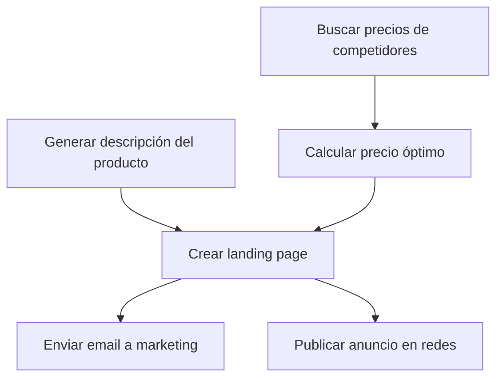

# Mistral Large 3 675B — orchestration/parallel_vs_sequential_judgment

- model_id: `mistralai/mistral-large-2512`
- success: True  | final: 8.88 | quality: 10.0
- latency_total: 8.973s | tokens_per_second: 66.6
- input_tokens: 1043 | output_tokens: 598
- judge_score: 5 | justificación: La respuesta es precisa, relevante, clara y ofrece un plan bien estructurado con un análisis detallado de dependencias, lo que la hace altamente útil para un emprendedor.

## Respuesta completa

### **Análisis de Dependencias y Optimización**

#### **1. Diagrama de Dependencias**
Las dependencias entre las tareas son las siguientes:

**Explicación de dependencias:**
- **A (Precios de competidores)** → **C (Calcular precio óptimo)**: El precio óptimo depende de los precios de la competencia.
- **B (Descripción del producto)** → **D (Landing page)**: La landing page necesita la descripción del producto.
- **C (Precio óptimo)** → **D (Landing page)**: La landing page también necesita el precio calculado.
- **D (Landing page)** → **E (Email a marketing)**: El email incluye el enlace de la landing, por lo que debe existir primero.
- **D (Landing page)** → **F (Anuncio en redes)**: El anuncio puede incluir el enlace a la landing.

---

#### **2. Plan de Ejecución Optimizado**
**Tareas paralelas (se ejecutan al mismo tiempo):**
- **A (Buscar precios de competidores)** y **B (Generar descripción del producto)** no tienen dependencias entre sí y pueden ejecutarse en paralelo.

**Tareas secuenciales (dependen de resultados previos):**
1. **A y B** (paralelas).
2. **C (Calcular precio óptimo)** depende de **A**.
3. **D (Crear landing page)** depende de **B y C**.
4. **E (Enviar email)** y **F (Publicar anuncio)** dependen de **D** y pueden ejecutarse en paralelo.

---

#### **3. Tiempo Estimado**
- **Tareas paralelas iniciales (A y B):** 5 minutos.
- **Tarea C (depende de A):** 5 minutos.
- **Tarea D (depende de B y C):** 5 minutos.
- **Tareas paralelas finales (E y F):** 5 minutos.

**Tiempo total estimado:**
**20 minutos** (en lugar de 30 minutos si fueran secuenciales).

---

### **Ejecución Inmediata**
Las tareas **A** y **B** no tienen dependencias y pueden iniciarse ahora. Procedo a ejecutarlas: