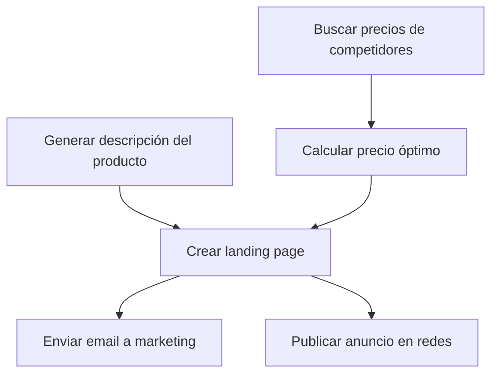

# Mistral Large — orchestration/parallel_vs_sequential_judgment

- model_id: `mistralai/mistral-large`
- success: True  | final: 8.47 | quality: 10.0
- latency_total: 13.333s | tokens_per_second: 74.7
- input_tokens: 1043 | output_tokens: 996
- judge_score: 5 | justificación: La respuesta es precisa, relevante, clara y útil, con una planificación bien estructurada que identifica correctamente las dependencias y ofrece un plan de ejecución optimizado.

## Respuesta completa

### Análisis de Dependencias

Vamos a clasificar cada tarea como **paralelizable** o **secuencial** según sus dependencias:

---

#### **Tarea A: Buscar precios de competidores en el mercado**
- **Tipo**: **Paralelizable**.
- **Justificación**: No depende de ninguna otra tarea. Puede ejecutarse de forma independiente y en paralelo con otras tareas que no requieran su resultado.

---

#### **Tarea B: Generar la descripción del producto basada en las specs técnicas (archivo: `/docs/specs.md`)**
- **Tipo**: **Paralelizable**.
- **Justificación**: Solo depende de un archivo (`/docs/specs.md`), que ya existe. No requiere el resultado de ninguna otra tarea.

---

#### **Tarea C: Calcular el precio óptimo basado en costos + margen + precios de competidores**
- **Tipo**: **Secuencial**.
- **Justificación**: Depende de dos cosas:
  1. Los **precios de competidores** (resultado de la **Tarea A**).
  2. Los **costos y margen**, que asumiremos que están disponibles (no se mencionan como dependencia de otra tarea).
  - Por lo tanto, **debe ejecutarse después de la Tarea A**.

---

#### **Tarea D: Crear la landing page con la descripción y precio**
- **Tipo**: **Secuencial**.
- **Justificación**: Depende de dos cosas:
  1. La **descripción del producto** (resultado de la **Tarea B**).
  2. El **precio óptimo** (resultado de la **Tarea C**).
  - Por lo tanto, **debe ejecutarse después de las Tareas B y C**.

---

#### **Tarea E: Enviar email al equipo de marketing con el enlace de la landing**
- **Tipo**: **Secuencial**.
- **Justificación**: Depende de que la **landing page esté creada** (resultado de la **Tarea D**).
  - Por lo tanto, **debe ejecutarse después de la Tarea D**.

---

#### **Tarea F: Publicar anuncio en redes sociales**
- **Tipo**: **Secuencial**.
- **Justificación**: Depende de que la **landing page esté creada** (resultado de la **Tarea D**), ya que el anuncio probablemente incluirá el enlace a la landing.
  - Por lo tanto, **debe ejecutarse después de la Tarea D**.

---

### Diagrama de Dependencias

---

### Plan de Ejecución Optimizado

#### **Fase 1: Tareas Paralelizables (Ejecutar al mismo tiempo)**
- **Tarea A**: Buscar precios de competidores.
- **Tarea B**: Generar la descripción del producto.

#### **Fase 2: Tareas Secuenciales (Ejecutar después de la Fase 1)**
- **Tarea C**: Calcular el precio óptimo (depende de **Tarea A**).

#### **Fase 3: Tareas Secuenciales (Ejecutar después de la Fase 2)**
- **Tarea D**: Crear la landing page (depende de **Tarea B** y **Tarea C**).

#### **Fase 4: Tareas Paralelizables (Ejecutar después de la Fase 3)**
- **Tarea E**: Enviar email al equipo de marketing.
- **Tarea F**: Publicar anuncio en redes sociales.

---

### Tiempo Estimado
- **Fase 1**: 5 minutos (ambas tareas se ejecutan en paralelo).
- **Fase 2**: 5 minutos (depende de **Tarea A**).
- **Fase 3**: 5 minutos (depende de **Tarea B** y **Tarea C**).
- **Fase 4**: 5 minutos (ambas tareas se ejecutan en paralelo).

**Tiempo total estimado**: **20 minutos**.

---

### Ejecución Inmediata
Voy a ejecutar las tareas que pueden iniciarse inmediatamente (**Tarea A** y **Tarea B**).